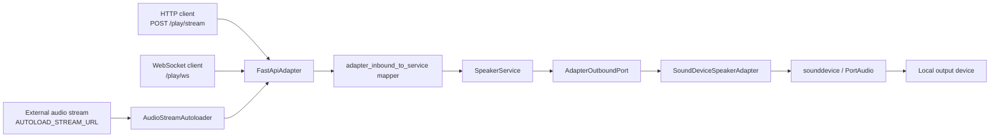
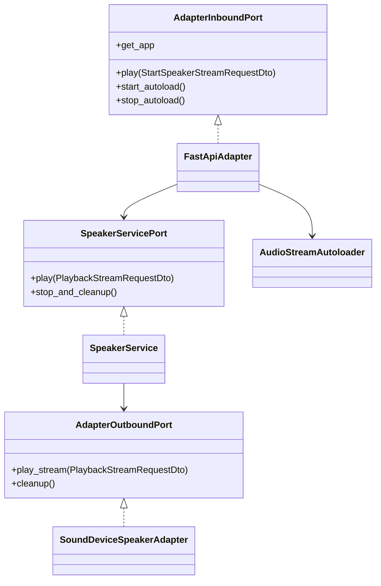
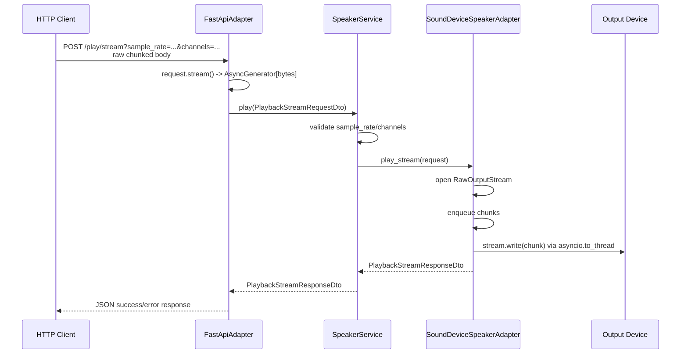
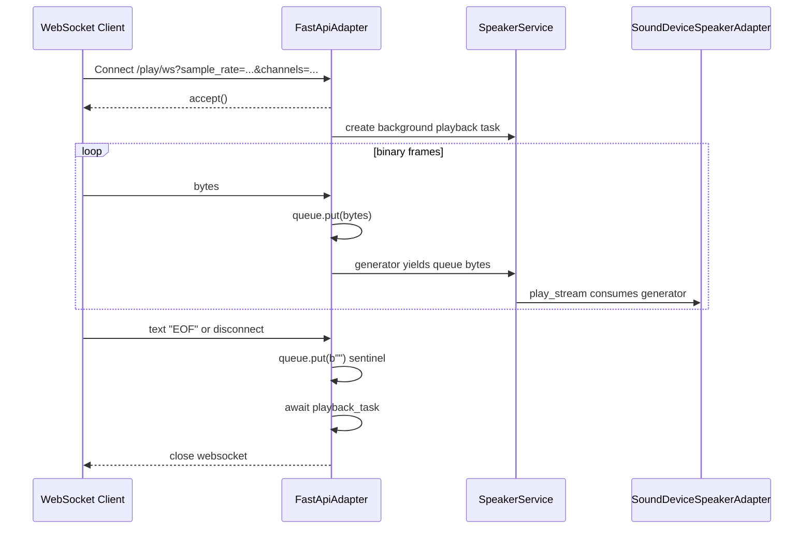
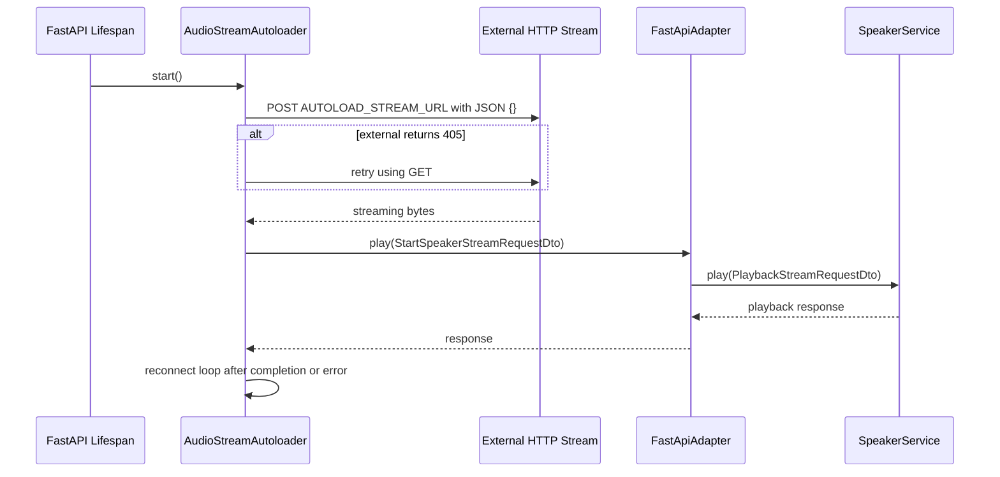
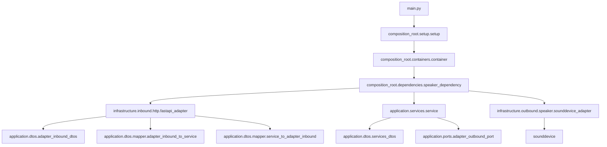

# Speaker Microservice

Technical handoff README for future maintainers and for AI/developer knowledge transfer when deriving related services from this codebase.

This document is based on direct repository inspection of the current project state. Items marked **Inferred** are conclusions drawn from code structure or naming. Items marked **Needs verification** require runtime testing on the target hardware or integration environment.

## Project Overview

The project is a Python FastAPI microservice that receives raw audio byte streams over HTTP or WebSocket and plays them through a local speaker/output device using `sounddevice` / PortAudio.

The service is structured as a small ports-and-adapters application:

- inbound adapter: FastAPI HTTP/WebSocket interface in `infrastructure/inbound/http/fastapi_adapter.py`
- application service: validation/orchestration in `application/services/service.py`
- outbound adapter: local audio hardware playback through `sounddevice` in `infrastructure/outbound/speaker/sounddevice_adapter.py`
- composition root: dependency construction, environment loading, FastAPI lifespan, and Uvicorn startup in `composition_root/`

Main responsibilities:

- expose health status at `GET /health`
- accept streamed raw PCM audio over `POST /play/stream`
- accept streamed raw PCM audio over `WebSocket /play/ws`
- optionally autoload and continuously consume an external streaming HTTP endpoint configured by `AUTOLOAD_STREAM_URL`
- select a speaker/output device either by explicit device index or keyword-based auto-discovery
- open a `sounddevice.RawOutputStream`, write audio bytes to it, and clean up the stream on shutdown

Core business logic:

- validate `sample_rate > 0`
- validate `channels > 0`
- map inbound streaming DTOs to internal service DTOs
- serialize playback through a single output stream; if a new playback request arrives while another is playing, the current playback task is cancelled before opening a new stream
- write raw `int16` PCM bytes to the selected output device

Main workflow and lifecycle:

1. `main.py` calls `asyncio.run(setup())`.
2. `composition_root/setup/setup.py` loads `.env`, reads `SERVICE_HOST` and `SERVICE_PORT`, builds the dependency container, and starts Uvicorn.
3. `composition_root/dependencies/speaker_dependency.py` reads hardware and inbound adapter configuration, creates the outbound adapter, creates the application service, creates the FastAPI app with lifespan hooks, then creates the inbound FastAPI adapter.
4. At FastAPI startup, the lifespan hook starts the optional autoloader if `AUTOLOAD_STREAM_URL` is configured.
5. Runtime requests call the inbound adapter, which maps to the service, which delegates to the outbound `sounddevice` adapter.
6. At FastAPI shutdown, the lifespan hook stops the autoloader and calls `service.stop_and_cleanup()`.

## Architecture

### High-Level Architecture



The project follows a hexagonal/clean architecture style in a lightweight way. The `application` package defines ports and DTOs; `infrastructure` contains concrete inbound/outbound adapters; `composition_root` wires concrete implementations together.

### Component Relationships



### Internal Modules and Responsibilities

| Module | Responsibility |
| --- | --- |
| `main.py` | Process entry point. Runs async setup and handles `KeyboardInterrupt`. |
| `composition_root/setup/setup.py` | Loads `.env`, builds container, configures Uvicorn, starts server, invokes cleanup after server exits. |
| `composition_root/containers/container.py` | Defines immutable `Container` dataclass and `BuildContainer()`. |
| `composition_root/dependencies/speaker_dependency.py` | Reads env vars, creates DTO configs, creates outbound adapter, service, FastAPI app/lifespan, and inbound adapter. |
| `application/ports/*.py` | Abstract service and adapter contracts. |
| `application/dtos/*.py` | Dataclass DTOs for inbound config/request/response, outbound config, service request/response, cleanup response. |
| `application/dtos/mapper/*.py` | Boundary mapping functions between adapter DTOs and service DTOs. |
| `application/services/service.py` | Application-level validation and delegation to outbound playback port. |
| `infrastructure/inbound/http/fastapi_adapter.py` | FastAPI routes and WebSocket handling. Converts network streams into async byte iterators. |
| `infrastructure/inbound/http/audio_stream_autoloader.py` | Optional background worker that connects to an external streaming HTTP endpoint and plays its bytes locally. |
| `infrastructure/outbound/speaker/sounddevice_adapter.py` | Device selection, `RawOutputStream` lifecycle, playback queue, audio writes, cleanup. |
| `tests/simple.py` | Manual/integration-style test that launches the service, checks health, and sends a generated sine wave over WebSocket. |

### Data Flow

HTTP playback:



WebSocket playback:



Autoload playback:



### Dependency Graph

Runtime dependency direction:



## Repository Structure

Current source tree, excluding `windows/` virtual environment and `__pycache__/` directories:

```text
.
|-- .env
|-- .env.example
|-- .vscode/
|   |-- launch.json
|   `-- settings.json
|-- application/
|   |-- dtos/
|   |   |-- adapter_inbound_dtos.py
|   |   |-- adapter_outbound_dtos.py
|   |   |-- services_dtos.py
|   |   `-- mapper/
|   |       |-- adapter_inbound_to_service.py
|   |       |-- service_to_adapter_inbound.py
|   |       `-- service_to_adapter_outbound.py
|   |-- ports/
|   |   |-- adapter_inbound_port.py
|   |   |-- adapter_outbound_port.py
|   |   `-- service_port.py
|   `-- services/
|       `-- service.py
|-- composition_root/
|   |-- containers/
|   |   `-- container.py
|   |-- dependencies/
|   |   `-- speaker_dependency.py
|   `-- setup/
|       `-- setup.py
|-- infrastructure/
|   |-- inbound/
|   |   `-- http/
|   |       |-- audio_stream_autoloader.py
|   |       `-- fastapi_adapter.py
|   `-- outbound/
|       `-- speaker/
|           `-- sounddevice_adapter.py
|-- main.py
|-- requirements.linux.txt
|-- requirements.windows.txt
|-- tests/
|   |-- conftest.py
|   `-- simple.py
`-- windows/
```

Important notes:

- `windows/` is a checked-in Python virtual environment containing interpreter binaries, scripts, installed packages, and dependency metadata. It is not application source.
- There is no `README.md` in the inspected state before this document.
- There is no Git metadata in the inspected workspace (`git status` reported "not a git repository").
- There is no Dockerfile, Compose file, `pyproject.toml`, package setup file, or CI/CD configuration in the project source tree.

Entry points:

- production/manual entry: `python main.py`
- VS Code debug entry: `.vscode/launch.json` launches `${workspaceFolder}/main.py` using `${workspaceFolder}/windows/Scripts/python.exe`
- manual integration test entry: `python tests/simple.py`

## Runtime Flow

### Startup Sequence

1. `main.py` imports `setup()` from `composition_root.setup.setup`.
2. `main.py` configures application logging with the resolved runtime environment.
3. `asyncio.run(setup())` starts the async application bootstrap.
4. `setup()` resolves the runtime environment from process variables, `.vscode/launch.json`, and the selected launch profile `envFile`.
5. `setup()` locates `.env` with `dotenv.find_dotenv('.env')` and loads it if present.
6. `SERVICE_HOST` is read with default `127.0.0.1`.
7. `SERVICE_PORT` is read with default `8003` and converted to `int`.
8. `BuildContainer(name="Speaker Microservice")` is called.
9. `generate_speaker_dependency()` builds the concrete dependency tree.
10. `container.speaker_dependency.adapter_inbound.app` is passed to Uvicorn.
11. Uvicorn is configured with:
   - host: `SERVICE_HOST`
   - port: `SERVICE_PORT`
   - `log_level="info"`
   - `timeout_keep_alive=60`
12. `await server.serve()` blocks until the server is stopped.

### Initialization Process

Dependency creation happens in `composition_root/dependencies/speaker_dependency.py`:

1. Read `SPEAKER_DEVICE_INDEX`.
   - Empty or missing means auto-discover the output device.
   - Non-empty value is converted with `int(...)`.
2. Read `SPEAKER_DEVICE_KEYWORDS`, defaulting to `i2s,hw,default,sysdefault`.
3. Create `InitOutboundAdapterDto(device_index, target_keywords)`.
4. Instantiate `SoundDeviceSpeakerAdapter`.
5. `SoundDeviceSpeakerAdapter.__init__()` calls `_initialize_device()`.
6. `_initialize_device()` calls `_select_output_device()`.
7. Device selection either uses the explicit configured index, selects the first output-capable device whose name contains any configured keyword, or falls back to `sd.default.device[1]`.
8. Instantiate `SpeakerService(outbound_port=adapter_outbound)`.
9. Define the FastAPI lifespan handler.
10. Create the FastAPI app.
11. Parse `ALLOWED_ORIGINS` into `InitInboundAdapterDto`.
12. Read `AUTOLOAD_STREAM_URL`.
13. Instantiate `FastApiAdapter`, which optionally creates `AudioStreamAutoloader` and registers routes.

### Service Registration

Routes are registered imperatively inside `FastApiAdapter.register_routes(app)`:

- `GET /health`
- `POST /play/stream`
- `WebSocket /play/ws`

FastAPI lifespan is defined before `FastApiAdapter` is instantiated. The closure captures `adapter_inbound`, initially `None`, and later assigned to the created adapter. On startup, the lifespan calls `adapter_inbound.start_autoload()` if available.

### Request Lifecycle

For `POST /play/stream`:

1. FastAPI receives a request body, intended to be raw chunked bytes.
2. Query parameters are bound:
   - `sample_rate: int = 24000`
   - `channels: int = 1`
3. `request.stream()` is wrapped as `AsyncGenerator[bytes]`.
4. `StartSpeakerStreamRequestDto` is created.
5. `FastApiAdapter.play()` maps inbound DTO to service DTO.
6. `SpeakerService.play()` validates sample rate and channel count.
7. `SoundDeviceSpeakerAdapter.play_stream()` opens an audio output stream and consumes the async byte iterator.
8. The route waits until playback stream consumption and queue cleanup complete.
9. A JSON response is returned.

For `WebSocket /play/ws`:

1. Server accepts the WebSocket.
2. An internal `asyncio.Queue[bytes]` is created.
3. A queue-backed async generator is wrapped in `StartSpeakerStreamRequestDto`.
4. Playback is started as a background task with `asyncio.create_task(self.play(...))`.
5. Binary WebSocket messages are enqueued as audio chunks.
6. Text message `"EOF"` ends the receive loop.
7. `WebSocketDisconnect` also ends the receive loop.
8. A sentinel empty byte string `b""` is put into the queue.
9. The route awaits the playback task, then attempts to close the WebSocket.

### Shutdown Behavior

Shutdown paths:

- `KeyboardInterrupt` in `main.py`: logs a shutdown message and exits with status `0`.
- Uvicorn/FastAPI shutdown: FastAPI lifespan calls:
  - `await adapter_inbound.stop_autoload()`
  - `await service.stop_and_cleanup()`
- `setup()` finally block calls `_cleanup(container)`, currently a placeholder that logs final setup-layer cleanup.

Outbound cleanup:

- `SoundDeviceSpeakerAdapter.cleanup()` cancels current playback task, stops the active `RawOutputStream` if active, closes it, and clears `self.stream`.

Autoloader cleanup:

- `AudioStreamAutoloader.stop()` cancels the worker task and suppresses `asyncio.CancelledError`.

## Ports & Interfaces

### Quick Port Reference

- Default listening address: `127.0.0.1:8003`
- HTTP health: `GET http://127.0.0.1:8003/health`
- HTTP raw PCM playback: `POST http://127.0.0.1:8003/play/stream?sample_rate=24000&channels=1`
- WebSocket raw PCM playback: `ws://127.0.0.1:8003/play/ws?sample_rate=24000&channels=1`
- Optional outbound autoload stream client: URL configured by `AUTOLOAD_STREAM_URL`
- Audio hardware interface: local `sounddevice.RawOutputStream` to selected output device

### Interface Summary Table

| Type | Port | Protocol | Path/Topic | Purpose | Handler | Dependencies |
| --- | --- | --- | --- | --- | --- | --- |
| Inbound HTTP | `SERVICE_PORT` default `8003` | HTTP | `GET /health` | Health check | `FastApiAdapter.health_check` closure | FastAPI only |
| Inbound HTTP | `SERVICE_PORT` default `8003` | HTTP | `POST /play/stream` | Stream raw PCM body to speaker | `FastApiAdapter.play_stream_http` closure | `SpeakerService`, `SoundDeviceSpeakerAdapter`, `sounddevice` |
| Inbound WebSocket | `SERVICE_PORT` default `8003` | WebSocket | `/play/ws` | Stream binary WebSocket frames to speaker | `FastApiAdapter.play_stream_ws` closure | `SpeakerService`, `SoundDeviceSpeakerAdapter`, `sounddevice` |
| Outbound HTTP client | N/A | HTTP/HTTPS | `AUTOLOAD_STREAM_URL` | Pull remote audio stream and play it locally | `AudioStreamAutoloader._worker` | `httpx.AsyncClient`, inbound adapter, service, sounddevice |
| Hardware output | N/A | PortAudio/native audio API | Selected sound device index | Play raw audio bytes | `SoundDeviceSpeakerAdapter` | `sounddevice`, PortAudio, OS audio driver |
| CLI/process | N/A | Local process | `python main.py` | Start service | `main.py` | Python, Uvicorn, env config |
| CLI/test | N/A | Local process + HTTP + WebSocket | `python tests/simple.py` | Manual E2E sine wave playback | `tests/simple.py` | Service process, health endpoint, WebSocket endpoint, local speaker |

### Inbound HTTP: `GET /health`

Purpose:

- Report that the FastAPI service is running and route registration succeeded.

Port:

- `SERVICE_PORT`, default `8003`

Protocol:

- HTTP

Path:

- `/health`

Authentication:

- None implemented.

Expected request format:

- No body.
- No query parameters.

Example request:

```bash
curl http://127.0.0.1:8003/health
```

Expected response format:

```json
{
  "action": "health_check",
  "status": "success",
  "status_code": 200,
  "message": "Speaker microservice is healthy",
  "timestamp": 1710000000.0,
  "data": {
    "timestamp": 1710000000.0
  }
}
```

Internal handler/module:

- `infrastructure/inbound/http/fastapi_adapter.py`
- Closure registered by `@app.get("/health", tags=["Health"])`

Dependencies triggered:

- None beyond FastAPI/JSON serialization.

Side effects:

- None.

Required environment variables:

- `SERVICE_HOST` and `SERVICE_PORT` determine where the service listens, but the route itself does not require additional variables.

Failure behavior:

- No explicit route-level failure handling. FastAPI/Uvicorn-level errors would apply.

Timeouts/retry behavior:

- No route-specific timeout or retry logic.

### Inbound HTTP: `POST /play/stream`

Purpose:

- Accept raw audio bytes via HTTP request body and play them to the selected speaker device.
- Intended for chunked transfer streaming, but also accepts a normal request body because the implementation uses `request.stream()`.

Port:

- `SERVICE_PORT`, default `8003`

Protocol:

- HTTP

Path:

- `/play/stream`

Query parameters:

| Parameter | Type | Default | Purpose |
| --- | --- | --- | --- |
| `sample_rate` | `int` | `24000` | Sample rate passed to `sounddevice.RawOutputStream`. |
| `channels` | `int` | `1` | Channel count passed to `sounddevice.RawOutputStream`. |

Authentication:

- None implemented.

Expected request format:

- Body: raw PCM bytes.
- Encoding expected by outbound adapter: signed 16-bit integer PCM (`dtype='int16'`).
- Byte order is not explicitly declared by the service. **Inferred:** little-endian PCM is expected by typical clients and by `tests/simple.py`, which packs samples with `struct.pack('<h', val)`.
- Content-Type is not checked.

Example request with an existing PCM file:

```bash
curl -X POST "http://127.0.0.1:8003/play/stream?sample_rate=24000&channels=1" \
  --data-binary "@audio.raw"
```

Example Python chunked client:

```python
import httpx

def chunks(path, size=4096):
    with open(path, "rb") as f:
        while data := f.read(size):
            yield data

with httpx.Client(timeout=None) as client:
    response = client.post(
        "http://127.0.0.1:8003/play/stream",
        params={"sample_rate": 24000, "channels": 1},
        content=chunks("audio.raw"),
    )
    print(response.status_code, response.json())
```

Success response:

```json
{
  "action": "play_stream_http",
  "status": "success",
  "status_code": 200,
  "message": "Playback session finalized successfully",
  "timestamp": 1710000000.0,
  "data": null
}
```

Failure response from service-level failure:

```json
{
  "action": "play_stream_http",
  "status": "error",
  "status_code": 500,
  "message": "Hardware stream open failure: ...",
  "timestamp": 1710000000.0,
  "data": null
}
```

Failure response from route exception:

```json
{
  "action": "play_stream_http",
  "status": "error",
  "status_code": 500,
  "message": "Failed to play stream: ...",
  "timestamp": 1710000000.0,
  "data": "..."
}
```

Internal handler/module:

- `infrastructure/inbound/http/fastapi_adapter.py`
- Closure registered by `@app.post("/play/stream", tags=["Playback"])`

Dependencies triggered:

- `StartSpeakerStreamRequestDto`
- `map_inbound_to_service_playback_request`
- `SpeakerService.play`
- `SoundDeviceSpeakerAdapter.play_stream`
- `sounddevice.RawOutputStream`

Side effects:

- Opens or replaces the current local audio output stream.
- If another playback is already active, current playback is cancelled via `cleanup_playback_task()`.
- Writes bytes to local speaker/output device.
- May stop/close an existing `sounddevice` stream before opening a new one.

Required environment variables:

- `SPEAKER_DEVICE_INDEX` or a discoverable/default output device.
- `SPEAKER_DEVICE_KEYWORDS` if relying on keyword auto-selection.
- `SERVICE_HOST` / `SERVICE_PORT` for binding.

Failure behavior:

- `sample_rate <= 0`: service returns `success=False` with `"Invalid sample rate. Must be positive."`, HTTP route converts this to 500.
- `channels <= 0`: service returns `success=False` with `"Invalid channel count. Must be positive."`, HTTP route converts this to 500.
- Hardware open failure: response is 500 with `"Hardware stream open failure: ..."`
- If opening at requested sample rate fails, adapter retries at `44100` Hz with same channel count and device index.
- Errors while consuming inbound stream are logged but `play_stream()` still returns success after cleanup. This means an interrupted inbound generator may still produce a 200 response. **Needs verification** whether this behavior is acceptable.
- Errors during `stream.write()` are logged and break the background worker, but `play_stream()` still generally returns success after queue cleanup. **Needs verification** for production error reporting requirements.

Timeouts/retry behavior:

- Uvicorn keep-alive timeout: 60 seconds.
- Playback queue join timeout during cleanup: 3 seconds.
- Internal audio worker polls queue with `asyncio.wait_for(queue.get(), timeout=0.1)`.
- Hardware stream open retry: one fallback attempt at 44100 Hz.
- No HTTP request-level timeout is configured by this service.

### Inbound WebSocket: `/play/ws`

Purpose:

- Accept raw PCM audio as binary WebSocket messages and play them to the selected speaker.

Port:

- `SERVICE_PORT`, default `8003`

Protocol:

- WebSocket

Path:

- `/play/ws`

Query parameters:

| Parameter | Type | Default | Purpose |
| --- | --- | --- | --- |
| `sample_rate` | `int` | `24000` | Sample rate passed to `sounddevice.RawOutputStream`. |
| `channels` | `int` | `1` | Channel count passed to `sounddevice.RawOutputStream`. |

Authentication:

- None implemented.

Expected request/event format:

- Binary frames: raw PCM audio chunks.
- Text frame `"EOF"`: graceful end-of-stream marker.
- Disconnect: also ends the server receive loop.

Expected response/event format:

- The server does not send application-level messages.
- On completion or disconnect it attempts to close the WebSocket.

Example client:

```python
import asyncio
import math
import struct
import websockets

async def sine_chunks(sample_rate=44100, duration=2.0, freq=440.0):
    chunk_size = 2048
    total = int(sample_rate * duration)
    for i in range(0, total, chunk_size):
        buf = bytearray()
        for j in range(chunk_size):
            if i + j >= total:
                break
            value = int(math.sin(2 * math.pi * freq * (i + j) / sample_rate) * 20000)
            buf.extend(struct.pack("<h", value))
        yield bytes(buf)
        await asyncio.sleep((chunk_size / sample_rate) * 0.8)

async def main():
    uri = "ws://127.0.0.1:8003/play/ws?sample_rate=44100&channels=1"
    async with websockets.connect(uri) as ws:
        async for chunk in sine_chunks():
            await ws.send(chunk)
        await ws.send("EOF")

asyncio.run(main())
```

Internal handler/module:

- `infrastructure/inbound/http/fastapi_adapter.py`
- Closure registered by `@app.websocket("/play/ws")`

Dependencies triggered:

- `asyncio.Queue`
- `StartSpeakerStreamRequestDto`
- `FastApiAdapter.play`
- `SpeakerService.play`
- `SoundDeviceSpeakerAdapter.play_stream`
- `sounddevice.RawOutputStream`

Side effects:

- Same playback/hardware side effects as HTTP playback.
- Starts a playback orchestration task per WebSocket connection.
- If concurrent playback is active, the outbound adapter cancels current playback before starting the new one.

Required environment variables:

- Same as `POST /play/stream`.

Failure behavior:

- WebSocket disconnect is logged and treated as stream termination.
- Exceptions from playback task are logged in `finally`.
- The server does not send a structured failure message to the WebSocket client.
- Invalid `sample_rate` or `channels` produces a failed service response inside the background playback task, but the WebSocket route does not forward that message to the client. **Needs verification** if client-visible error reporting is required.

Timeouts/retry behavior:

- No WebSocket-specific timeout or ping/pong behavior is configured.
- Audio worker queue polling and cleanup timeouts are the same as HTTP playback.

### Optional Outbound HTTP Autoload Client: `AUTOLOAD_STREAM_URL`

Purpose:

- On service startup, automatically connect to a configured external streaming audio endpoint and play received bytes locally.

Configured by:

- `AUTOLOAD_STREAM_URL`

Protocol:

- HTTP or HTTPS, depending on URL.

Endpoint/path:

- Arbitrary URL from environment. Current checked-in `.env` uses:

```text
http://127.0.0.1:8002/process/stream/get
```

Authentication:

- None implemented. No headers, tokens, or credentials are configured.

Request behavior:

- Starts with `POST`.
- Sends JSON body `{}` for POST.
- If the response status is `405` while using POST, switches method to `GET` and retries immediately in the loop.
- Uses `httpx.AsyncClient(timeout=None)`.
- Calls `response.raise_for_status()`.
- Iterates `response.aiter_bytes()`.
- Wraps remote bytes in `StartSpeakerStreamRequestDto(sample_rate=24000, channels=1)`.

Internal handler/module:

- `infrastructure/inbound/http/audio_stream_autoloader.py`
- Started by FastAPI lifespan in `composition_root/dependencies/speaker_dependency.py`

Dependencies triggered:

- `httpx.AsyncClient`
- `FastApiAdapter.play`
- `SpeakerService`
- `SoundDeviceSpeakerAdapter`
- local audio hardware

Side effects:

- Opens persistent outbound HTTP connection.
- Plays remote stream bytes through local speaker.
- Reconnects forever while service is running.
- May compete with inbound playback; `SoundDeviceSpeakerAdapter` allows only one active playback and cancels existing playback when a new one starts.

Required environment variables:

- `AUTOLOAD_STREAM_URL`
- audio device env/config same as local playback

Failure behavior:

- `httpx.RequestError`: logs connection error and reconnects after 5 seconds.
- Any other exception: logs stack trace through `logger.exception(...)` and reconnects after 5 seconds.
- `asyncio.CancelledError`: logs cancellation and exits worker.
- HTTP error statuses other than the POST 405 fallback are raised by `response.raise_for_status()` and handled by the generic exception path.

Timeouts/retry behavior:

- HTTP client timeout is disabled (`timeout=None`) to support long-lived streams.
- Reconnect delay after request or unexpected errors: 5 seconds.
- No retry limit, jitter, backoff, circuit breaker, or health state is implemented.

### Hardware Device Interface: `sounddevice.RawOutputStream`

Purpose:

- Write raw PCM bytes to a selected local output device through PortAudio.

Protocol/interface:

- Python `sounddevice` package over PortAudio/native OS audio APIs.

Device selection:

1. If `SPEAKER_DEVICE_INDEX` is configured and non-empty, use it directly as `int`.
2. Otherwise call `sd.query_devices()`.
3. Iterate devices with `max_output_channels > 0`.
4. Select the first device whose name contains any keyword from `SPEAKER_DEVICE_KEYWORDS` case-insensitively.
5. If no keyword match, use `sd.default.device[1]`.
6. If no valid default output exists, raise `RuntimeError`.

Stream opening:

```python
sd.RawOutputStream(
    samplerate=sample_rate,
    channels=channels,
    dtype="int16",
    device=self.device_index,
)
```

Fallback:

- If opening the stream at the requested sample rate fails, retry once with `samplerate=44100`.

Concurrency:

- `SoundDeviceSpeakerAdapter` has a single mutable `self.stream`, `_playback_task`, and `_is_playing`.
- When `play_stream()` starts while `_is_playing` is true, it calls `cleanup_playback_task()` to cancel the existing playback task.
- **Needs verification:** Concurrent HTTP/WebSocket/autoload calls are not protected by an explicit lock, so overlapping `play_stream()` calls may race around shared stream state.

Failure behavior:

- Device query/bootstrap failure raises `RuntimeError` and prevents service startup.
- Stream open failure returns `PlaybackStreamResponseDto(success=False, message="Hardware stream open failure: ...")`.
- Write failures are logged and break the audio worker loop.

### Other Interfaces

GraphQL:

- None found.

MQTT:

- None found.

Message queues:

- No external message queue.
- Internal in-memory `asyncio.Queue` is used for WebSocket buffering and outbound playback worker buffering.

Serial ports:

- None found.

Cron/scheduled jobs:

- None found.

Background workers:

- Optional `AudioStreamAutoloader` task when `AUTOLOAD_STREAM_URL` is set.
- Per-playback internal audio worker task in `SoundDeviceSpeakerAdapter.play_stream()`.
- Per-WebSocket playback task in `FastApiAdapter.play_stream_ws()`.

File watchers:

- None found.

IPC mechanisms:

- None found beyond local subprocess use in `tests/simple.py`.

CLI commands:

- `python main.py`: start service.
- `python tests/simple.py`: launch service subprocess and perform manual WebSocket playback test.

Internal event buses:

- None found.

## Data Model

There is no database, ORM, migration system, schema registry, or persistent domain data model.

The service data model is composed of immutable dataclass DTOs:

| DTO | File | Fields | Purpose |
| --- | --- | --- | --- |
| `InitInboundAdapterDto` | `application/dtos/adapter_inbound_dtos.py` | `allow_origins: tuple[str, ...]`, `autoload_stream_url: str \| None` | Configuration for inbound HTTP/WebSocket adapter. |
| `StartSpeakerStreamRequestDto` | `application/dtos/adapter_inbound_dtos.py` | `audio_stream: AsyncIterator[bytes]`, `sample_rate: int = 24000`, `channels: int = 1` | Inbound playback request. |
| `StartSpeakerStreamResponseDto` | `application/dtos/adapter_inbound_dtos.py` | `success: bool`, `message: str` | Inbound playback result. |
| `InitOutboundAdapterDto` | `application/dtos/adapter_outbound_dtos.py` | `device_index: Optional[int]`, `target_keywords: tuple[str, ...]` | Hardware output configuration. |
| `PlaybackStreamRequestDto` | `application/dtos/services_dtos.py` | `audio_stream: AsyncIterator[bytes]`, `sample_rate: int`, `channels: int` | Internal service playback request. |
| `PlaybackStreamResponseDto` | `application/dtos/services_dtos.py` | `success: bool`, `message: str` | Internal service playback result. |
| `SpeakerCleanupResponseDto` | `application/dtos/services_dtos.py` | `success: bool` | Cleanup result. |

Relationships:

- `StartSpeakerStreamRequestDto` maps one-to-one to `PlaybackStreamRequestDto`.
- `PlaybackStreamResponseDto` maps one-to-one to `StartSpeakerStreamResponseDto`.
- Audio payloads are streams of `bytes`, not loaded into a single in-memory object by the inbound adapter.

Caching strategy:

- No persistent cache.
- Runtime buffering uses in-memory `asyncio.Queue`.
- No bounded queue sizes are configured. **Needs verification:** long producer/slow speaker scenarios may grow memory usage.

## Configuration

Configuration is loaded from VS Code launch configuration and `.env` if present. `.env.example` documents the intended variables.

| Variable | Required | Default | Purpose | Example |
| --- | --- | --- | --- | --- |
| `SERVICE_HOST` | No | `127.0.0.1` | Host/IP for Uvicorn to bind. | `127.0.0.1` |
| `SERVICE_PORT` | No | `8003` | Port for Uvicorn to listen on. Converted to `int`. | `8003` |
| `APP_ENV` | No | `development` | Runtime environment. Supported values: `development`, `staging`, `production`. | `development` |
| `VSCODE_ENV` | No | unset | Optional alternate runtime environment variable. `APP_ENV` takes precedence when both are set. | `staging` |
| `VSCODE_LAUNCH_PROFILE` | No | inferred | Optional launch profile name used when resolving fallback env values from `.vscode/launch.json`. | `Python: Debug (development)` |
| `SPEAKER_DEVICE_INDEX` | No | empty / `None` | Explicit `sounddevice` output device index. Empty means auto-detect. | `3` |
| `SPEAKER_DEVICE_KEYWORDS` | No | `i2s,hw,default,sysdefault` | Comma-separated keywords used to auto-select output device by name. | `i2s,hw,default,sysdefault` |
| `ALLOWED_ORIGINS` | No | `*` | Parsed into inbound adapter config. Intended CORS origins. | `*` |
| `AUTOLOAD_STREAM_URL` | No | empty / `None` | If set, starts background worker that connects to this HTTP stream and plays bytes. | `http://127.0.0.1:8002/process/stream/get` |

Important configuration notes:

- The checked-in VS Code launch profiles map to environments as follows: `Python: Debug (development)` -> `APP_ENV=development`, `Python: Debug (staging)` -> `APP_ENV=staging`, and `Python: Debug (production)` -> `APP_ENV=production`.
- Runtime environment resolution precedence is: process environment `APP_ENV`, process environment `VSCODE_ENV`, selected VS Code launch profile `env.APP_ENV`, selected VS Code launch profile `env.VSCODE_ENV`, selected launch profile `envFile` values, then the safe fallback `development`.
- Launch profile selection uses `VSCODE_LAUNCH_PROFILE` when present. If it is absent and exactly one launch profile targets `main.py`, that profile is used as the fallback source.
- Invalid environment values are ignored and the resolver continues down the precedence chain. Supported values are `development`, `staging`, and `production`.
- `ALLOWED_ORIGINS` is parsed and stored in `InitInboundAdapterDto`, but CORS middleware is not registered with `app.add_middleware(...)`. Therefore CORS behavior is currently FastAPI's default, not the configured variable. **Needs verification / technical debt.**
- No secrets are currently required by the inspected code.
- If `SERVICE_PORT` or `SPEAKER_DEVICE_INDEX` contain non-integer values, startup will fail with `ValueError`.

Logging behavior:

- Application logs use `runtime.logger.get_logger()` and include timestamp, environment, level, logger scope, and message.
- `development` shows `trace`, `info`, `warn`, `error`, and `critical`.
- `staging` shows `warn`, `error`, and `critical`.
- `production` shows `critical` only.
- FastAPI/Uvicorn request logs, startup logs, shutdown logs, and server errors are not filtered by the application logger and remain visible in every environment.

To add a new launch profile, copy the existing `.vscode/launch.json` profile, set a unique `name`, set `VSCODE_LAUNCH_PROFILE` to the same name, and set `APP_ENV` to one of `development`, `staging`, or `production`. Adding a new environment requires updating `SUPPORTED_ENVIRONMENTS` and the log-level map in `runtime/`.

Config files:

- `.env`: local runtime config.
- `.env.example`: template config.
- `.vscode/settings.json`: points VS Code Python interpreter to `windows/Scripts/python.exe`.
- `.vscode/launch.json`: debug launch config for `main.py`, env file `.env`, and explicit runtime environment values.
- `requirements.windows.txt`: Python dependency list for Windows.
- `requirements.linux.txt`: Python dependency list for Linux/Raspberry Pi-style hosts, including a note to install PortAudio/system sound packages first.

## Build & Deployment

### Local Run on Windows

Using the checked-in virtual environment:

```powershell
.\windows\Scripts\Activate.ps1
python main.py
```

Or directly:

```powershell
.\windows\Scripts\python.exe main.py
```

Using a fresh virtual environment:

```powershell
python -m venv .venv
.\.venv\Scripts\Activate.ps1
pip install -r requirements.windows.txt
python main.py
```

### Local Run on Linux / Raspberry Pi

Install system audio dependencies first:

```bash
sudo apt-get update
sudo apt-get install -y portaudio19-dev python3-pyaudio python3-sounddevice
```

Then:

```bash
python3 -m venv .venv
. .venv/bin/activate
pip install -r requirements.linux.txt
python main.py
```

### Build

There is no package build configuration (`pyproject.toml`, `setup.py`, `setup.cfg`) for the application itself. This project is currently run directly from source.

### Docker Usage

No Dockerfile or Docker Compose configuration was found.

**Inferred:** Containerizing this service would require explicit access to host audio devices and PortAudio/native sound libraries. On Linux this commonly means mapping ALSA/PulseAudio/PipeWire devices/sockets into the container. This is not implemented in the current repository.

### CI/CD Behavior

No CI/CD configuration was found:

- no `.github/workflows`
- no GitLab CI file
- no Azure Pipelines file
- no Docker build pipeline

### Production Deployment Process

No production deployment process is encoded in the repository.

**Inferred:** The service is intended to run as a local microservice on the same machine that has speaker/audio hardware attached, likely alongside another service on port `8002` that can provide audio bytes through `/process/stream/get`.

Infrastructure assumptions:

- Python runtime with async support.
- Network access for clients to reach `SERVICE_HOST:SERVICE_PORT`.
- Local output audio device accessible through PortAudio.
- If autoload is enabled, the configured external stream endpoint is reachable from this process.

## Dependencies

Declared dependencies are identical in `requirements.windows.txt` and `requirements.linux.txt`, except the Linux file includes an OS package installation note.

| Dependency | Purpose | Critical Notes |
| --- | --- | --- |
| `fastapi` | HTTP/WebSocket API framework and lifespan support. | Routes are registered imperatively in `FastApiAdapter`. |
| `uvicorn` | ASGI server. | Configured directly in `setup.py`; keep-alive timeout set to 60 seconds. |
| `python-dotenv` | Load `.env` configuration. | Uses `find_dotenv('.env')` and `load_dotenv`. |
| `httpx` | Optional outbound autoload streaming HTTP client. | `AsyncClient(timeout=None)` for long-lived streams. |
| `sounddevice` | Audio output through PortAudio. | Core hardware dependency; requires working PortAudio/native audio stack. |
| `soundfile` | Audio/DSP dependency. | Declared but not used by current source code. |
| `numpy` | Audio/DSP dependency. | Declared but not used by current source code. |
| `pytest` | Testing/development. | No conventional pytest tests found; `tests/simple.py` is executable script style. |
| `websockets` | Manual integration test WebSocket client. | Used in `tests/simple.py`. |

Version constraints:

- Requirement files do not pin versions.
- The checked-in `windows/` virtual environment currently contains versions such as `sounddevice 0.5.5`, `httpx 0.28.1`, `pytest 9.0.3`, and `numpy 2.4.5`, but these are artifacts of the local environment, not enforced constraints.
- **Needs verification:** For stable deployment, pin dependency versions and document supported Python versions.

## State & Persistence

Databases:

- None.

File storage:

- None for runtime application data.

Cache:

- None persistent.
- In-memory queues buffer audio chunks during active playback.

Session management:

- No user sessions.
- WebSocket connection state is local to each route invocation.

Persistent runtime state:

- `SoundDeviceSpeakerAdapter.device_index`: selected at startup.
- `SoundDeviceSpeakerAdapter.stream`: current `sounddevice.RawOutputStream`, replaced per playback.
- `SoundDeviceSpeakerAdapter._playback_task`: current internal playback worker task.
- `SoundDeviceSpeakerAdapter._is_playing`: current playback flag.
- `AudioStreamAutoloader._task`: optional background stream connection worker.

## Failure & Recovery

Known failure points:

- Invalid integer env vars (`SERVICE_PORT`, `SPEAKER_DEVICE_INDEX`) fail startup.
- `sounddevice` device query failure raises `RuntimeError` and fails startup.
- No output device available fails startup.
- Explicit `SPEAKER_DEVICE_INDEX` may be invalid for the host and cause stream open failure at playback time.
- Requested sample rate may be unsupported; adapter retries with 44100 Hz.
- Requested channel count may be unsupported; no channel fallback is implemented.
- Remote autoload stream may be unavailable; worker retries forever every 5 seconds.
- Concurrent playback requests can cancel each other.
- Unbounded queues can grow if input arrives faster than the output device writes.
- Write failures are logged but may still result in a successful response.

Retry logic:

- Stream open retry: requested sample rate -> 44100 Hz.
- Autoload HTTP method fallback: POST -> GET on 405.
- Autoload reconnect: 5 seconds after `httpx.RequestError` or unexpected exceptions.
- No retry for inbound HTTP/WebSocket clients.

Error handling strategy:

- Inbound HTTP catches exceptions and returns JSON 500.
- Inbound WebSocket logs disconnects and playback task failures but does not send structured errors to clients.
- Application service returns failure DTOs for invalid sample rate/channel count.
- Outbound adapter logs hardware/write/stream-consumption errors.
- Autoloader logs errors and stack traces through Python logging, then retries.

Recovery mechanisms:

- Shutdown cleanup closes audio stream.
- New playback cancels current playback before starting another.
- Autoloader can recover from transient external stream failures by reconnecting.

## Security

Authentication:

- None implemented for HTTP endpoints, WebSocket endpoint, or autoload outbound stream.

Authorization:

- None implemented.

Secrets handling:

- No secrets are required by current code.
- `.env` is present in the project and currently contains only local host/port/device/autoload config. If secrets are added later, `.env` should not be committed.

Sensitive flows:

- Any client that can reach the service can trigger local speaker playback.
- Any client that can reach `POST /play/stream` or `WebSocket /play/ws` can stream arbitrary bytes to the audio device.
- The autoloader trusts `AUTOLOAD_STREAM_URL` and plays whatever bytes it returns.

Exposed attack surface:

- `GET /health`: unauthenticated metadata endpoint.
- `POST /play/stream`: unauthenticated streaming request body. Potential denial-of-service vector through long-lived or high-volume streams.
- `WebSocket /play/ws`: unauthenticated persistent connection. Potential denial-of-service vector through many connections or high-volume frames.
- Optional outbound HTTP client: can connect indefinitely to configured URL with no timeout.
- CORS configuration is currently not active despite the `ALLOWED_ORIGINS` env var.

Recommended security hardening for production:

- Add authentication for playback endpoints.
- Add request size/rate limits or bounded queues.
- Add client-visible error responses for WebSocket failures.
- Register CORS middleware if browser clients are intended.
- Restrict bind host to loopback unless remote clients are required.
- Validate audio format assumptions explicitly.

## Derived Project Transfer Notes

Reusable parts:

- Ports-and-adapters package layout.
- DTO boundary mapping pattern.
- FastAPI route adapter wrapping incoming byte streams as `AsyncIterator[bytes]`.
- WebSocket binary-frame-to-async-generator pattern.
- Lifespan-managed background worker startup/shutdown.
- `sounddevice.RawOutputStream` adapter for raw PCM playback.
- Device auto-selection by keyword with default-device fallback.

Tightly coupled parts:

- The outbound adapter is tightly coupled to `sounddevice`, PortAudio, and local OS audio devices.
- Audio format is implicitly raw signed 16-bit PCM.
- Default sample rate and autoloader sample rate are hardcoded to 24000 Hz.
- Fallback sample rate is hardcoded to 44100 Hz.
- The autoloader is coupled back into the inbound adapter by calling `inbound_adapter.play(dto)` rather than the service directly.
- Single shared `SoundDeviceSpeakerAdapter` instance means playback sessions are globally serialized/cancelling.

Assumptions to preserve for compatibility:

- Clients send raw PCM byte chunks, not WAV/MP3/Opus containers.
- WebSocket clients send `"EOF"` as a text frame to end gracefully.
- Query parameters `sample_rate` and `channels` control playback stream opening.
- Response envelopes contain `action`, `status`, `status_code`, `message`, `timestamp`, and `data` for HTTP endpoints.
- Default service port is `8003`.
- Autoload endpoint, if configured, returns a byte stream compatible with 24000 Hz mono int16 PCM.

Recommended extension points:

- Add new inbound transports by implementing `AdapterInboundPort` or adding another infrastructure adapter that maps to `SpeakerServicePort`.
- Add new output backends by implementing `AdapterOutboundPort`.
- Add richer audio validation/conversion in the application service or a dedicated domain component before calling the outbound port.
- Add authentication middleware at FastAPI app construction time in `speaker_dependency.py`.
- Add queue bounds/backpressure in `FastApiAdapter` and `SoundDeviceSpeakerAdapter`.
- Expand structured logging with request IDs/correlation IDs if this service becomes multi-client or distributed.

Safe refactoring boundaries:

- DTOs and mappers can be changed together if all adapter/service call sites are updated.
- `SpeakerService` is intentionally thin and can absorb format validation without touching FastAPI route code.
- `SoundDeviceSpeakerAdapter` can be replaced behind `AdapterOutboundPort` if derived projects need file output, network output, or another audio library.
- `AudioStreamAutoloader` can be moved to depend on `SpeakerServicePort` directly, reducing its coupling to `FastApiAdapter`.

Hidden coupling / implicit behavior:

- `ALLOWED_ORIGINS` looks functional but currently has no effect.
- `service_to_adapter_outbound.py` exists but is not used by `SpeakerService`; the service passes service DTOs directly to `AdapterOutboundPort.play_stream()`.
- `PlaybackStreamRequestDto` is used as both service request and outbound request in `service_to_adapter_outbound.py`; the alias says `OutboundPlaybackRequest` but imports the same class.
- `AudioStreamAutoloader` uses fixed `sample_rate=24000` and `channels=1`; these are not configurable.
- `SoundDeviceSpeakerAdapter.play_stream()` can return success even after some stream consumption or write errors.
- Startup fails immediately if no sound device can be selected because device initialization happens in the constructor.
- `.vscode` config assumes the checked-in `windows/` virtual environment.

If rebuilding this project from scratch, what matters most:

1. Preserve the stream contract: inbound clients provide raw int16 PCM chunks plus sample rate and channel count.
2. Preserve a single clear playback orchestration point that owns the hardware stream lifecycle.
3. Decide whether concurrent playback should cancel, mix, queue, or reject; current behavior cancels existing playback.
4. Keep hardware concerns behind an outbound port so derived projects can swap `sounddevice`.
5. Make autoload behavior explicit: it is a long-running outbound stream client with infinite retry.
6. Document and enforce audio format, sample width, endian-ness, channel layout, and backpressure rules.
7. Add operational safeguards before exposing beyond localhost: auth, rate limits, bounded queues, structured errors, and CORS if needed.

## Unknowns / Technical Debt

- **Needs verification:** Exact target hardware platform. The dependency keywords (`i2s`, `hw`, `default`, `sysdefault`) and Linux requirement note suggest Linux/Raspberry Pi or embedded speaker hardware, but the current workspace is Windows.
- **Needs verification:** Audio producer contract for `AUTOLOAD_STREAM_URL`. The example local stream URL points to `http://127.0.0.1:8002/process/stream/get`, but that service is not part of this repository.
- **Needs verification:** Whether remote stream bytes are guaranteed to be 24000 Hz mono int16 PCM.
- **Needs verification:** Whether HTTP playback should return success when the inbound stream read fails after playback starts.
- **Needs verification:** Whether WebSocket clients need structured error events.
- `ALLOWED_ORIGINS` is parsed but not applied to FastAPI middleware.
- No dependency versions are pinned.
- No conventional automated unit tests are present.
- `tests/simple.py` is a manual integration test that plays audible sound and starts a subprocess; it is not a normal pytest test despite the `tests/` location.
- No Docker/deployment/CI configuration exists.
- Application logging is configured in `main.py` through `runtime.logger.configure_logging(...)`; if `setup()` is reused directly, callers should configure logging first.
- `soundfile` and `numpy` are declared dependencies but not used by application source.
- `service_to_adapter_outbound.py` mapper is unused.
- Queue sizes are unbounded.
- Playback concurrency has no explicit lock around shared adapter state.
- There is no endpoint to stop playback explicitly except by ending the current stream, disconnecting WebSocket, starting another playback, or shutting down the service.
- There is no readiness endpoint that verifies the selected hardware stream can actually open; `/health` only verifies the HTTP service is alive.
