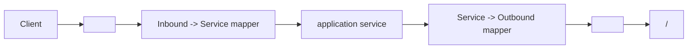
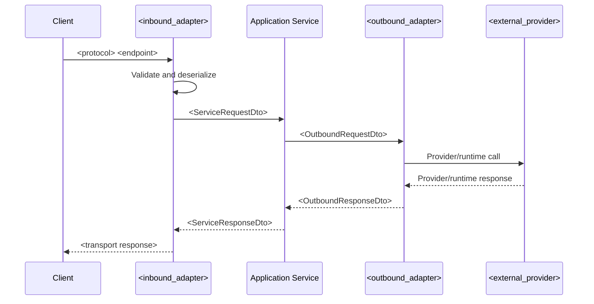
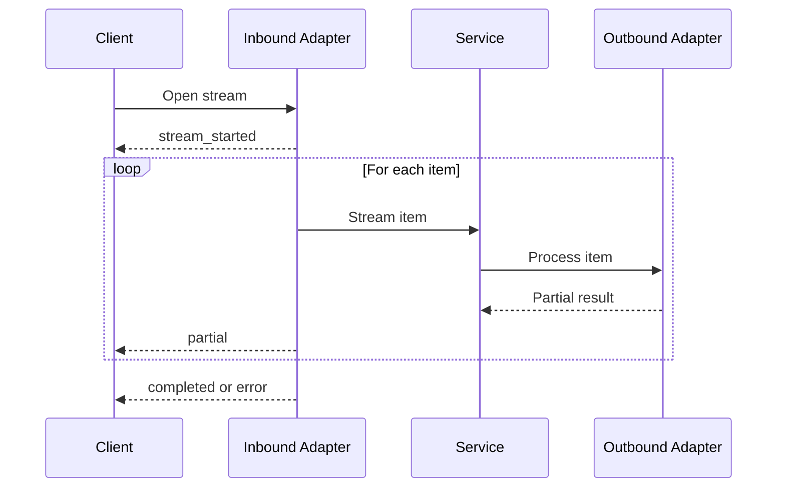

# Generalized Microservice Service-Pattern Report

Date: 2026-06-25

Scope: this document defines a reusable base pattern for generating future service-specific architecture reports for microservices that follow a layered, ports-and-adapters style. It intentionally avoids concrete service names and source-specific implementation details.

## 1. Executive Summary

The standard service pattern is a small, independently deployable microservice organized around clear runtime, application, and infrastructure boundaries. The preferred architecture is a ports-and-adapters model:

- An entry point starts the runtime.
- A composition root builds the dependency graph.
- Inbound adapters expose transport protocols such as HTTP.
- Application services orchestrate use cases through abstract ports.
- DTOs and mappers isolate layer contracts.
- Outbound adapters handle external providers, hardware, databases, queues, files, or other runtime dependencies.
- Tests verify contracts, layer behavior, and error handling.

Future reports generated from this base should describe verified implementation only. If a layer, contract, dependency, test type, or deployment artifact is absent, mark it as missing rather than inferring it.

Evidence to look for:

- `main.py`, `app.py`, or equivalent runtime entry point.
- `composition_root/`, dependency container, factory, or setup module.
- `application/` services, DTOs, and ports.
- `infrastructure/` inbound and outbound adapters.
- Runtime configuration files.
- Tests and documentation.

Mark as missing if absent:

- Clear entry point.
- Explicit service boundary.
- Application-layer orchestration.
- Abstract ports/interfaces.
- Runtime configuration documentation.
- Test coverage for main flows.

## 2. Purpose of the Base Pattern Report

This report is a canonical template for describing services that share a common architecture style. It should be used to produce service-specific audits without copying details from unrelated services.

Required use:

- Identify the actual files present in `<service_name>`.
- Map those files to generalized architectural layers.
- Describe verified control flow, contracts, dependencies, and risks.
- Use consistent section names, tables, and diagrams across service reports.

Optional use:

- Add service-specific diagrams where the implementation has complex flows.
- Add deeper file-level analysis for large adapters or orchestration modules.
- Add maturity scoring when enough evidence exists.

Evidence to look for:

- Source files that prove the pattern.
- Tests that verify the pattern.
- Config and deployment files that expose runtime behavior.

Mark as missing if absent:

- Any service-specific evidence for a claimed pattern.

## 3. Standard Service Folder Structure

Recommended structure:

```text
<service_name>/
  main.py
  README.md
  requirements.txt
  Dockerfile
  application/
    dtos/
      adapter_inbound_dtos.py
      services_dtos.py
      adapter_outbound_dtos.py
      mapper/
    ports/
      adapter_inbound_port.py
      service_port.py
      adapter_outbound_port.py
    services/
      service.py
  composition_root/
    containers/
      container.py
    dependencies/
      <service_name>_dependency.py
    setup/
      setup.py
  infrastructure/
    inbound/
      http/
        fastapi_adapter.py
    outbound/
      <outbound_adapter>.py
    logger.py
    config.py
  runtime/
    environment.py
    logger.py
  tests/
    test_<contract>.py
    test_<environment>.py
```

Required folders:

- `application/`
- `composition_root/`
- `infrastructure/`
- `tests/`, unless explicitly undocumented or not yet implemented.

Optional folders:

- `runtime/`
- `docs/`
- `scripts/`
- `migrations/`
- `schemas/`
- `generated/`

Evidence to look for:

- Actual directory tree.
- Imports showing dependencies between folders.
- Tests matching runtime behaviors.

Mark as missing if absent:

- Dedicated test organization.
- Dedicated config/runtime organization.
- Documentation for service setup.

## 4. Naming Conventions

Recommended naming:

| Concept | Pattern | Example |
|---|---|---|
| Service directory | `<service_name>_microservice` or `<service_name>` | `<domain_action>_microservice` |
| Entry point | `main.py` | `main.py` |
| Setup module | `composition_root/setup/setup.py` | `async def setup()` |
| Dependency module | `composition_root/dependencies/<service_name>_dependency.py` | `generate_<service_name>_dependency()` |
| Container | `Container`, `BuildContainer` | `BuildContainer(name="<service_name>")` |
| Inbound adapter | `FastApiAdapter`, `<protocol>Adapter` | `FastApiAdapter` |
| Application service | `<ServiceName>Service` | `<DomainAction>Service` |
| Outbound adapter | `<Provider><DomainAction>Adapter` | `<ExternalProvider>Adapter` |
| Ports | `AdapterInboundPort`, `ServicePort`, `AdapterOutboundPort` | `ServicePort` |
| DTOs | `<Action>RequestDto`, `<Action>ResponseDto` | `ProcessRequestDto` |

Required convention:

- Names should communicate architectural role, not only technology.

Optional convention:

- Include provider names in outbound adapters when multiple providers exist.

Evidence to look for:

- Class names.
- Function names.
- File names.
- Import paths.

Mark as missing if absent:

- Consistent service naming.
- Clear separation between adapter, service, and port names.

## 5. Layer Organization

Standard layers:


Required layers:

- Entry point/bootstrap.
- Composition root.
- Inbound adapter.
- Application service.
- Ports/interfaces.
- DTO/schema boundary.
- Outbound adapter when the service calls external systems.
- Tests.

Optional layers:

- Domain model.
- Repository/persistence.
- Event producer/consumer.
- Scheduler/background worker.
- Observability/metrics/tracing.
- Migration/schema generation.

Evidence to look for:

- Files and imports proving the layer exists.
- Methods showing control flow through layers.

Mark as missing if absent:

- Repository layer when the service has no persistence.
- Event layer when no queue/event broker exists.
- Domain layer when logic is procedural or adapter-centric.

## 6. Layer Responsibilities

| Layer | Responsibilities | Should avoid |
|---|---|---|
| Entry point | Process startup, top-level exception handling, calling setup. | Business logic. |
| Bootstrap/setup | Runtime env loading, server creation, shutdown hook. | Use-case logic. |
| Composition root | Construct adapters, services, ports, app, lifespan. | Per-request behavior. |
| Inbound adapter | HTTP/RPC/event parsing, validation, response serialization. | Provider SDK calls, persistence details. |
| Application service | Use-case orchestration, port calls, service-level DTO mapping. | Framework-specific response objects. |
| Ports/interfaces | Abstract contracts between layers. | Concrete implementation behavior. |
| DTO/schema | Data shape between layers. | Side effects. |
| Outbound adapter | External provider, hardware, storage, broker, or filesystem calls. | HTTP route construction. |
| Config/runtime | Environment resolution and defaults. | Hidden global behavior. |
| Tests | Contract, unit, integration, and flow verification. | Testing implementation details only. |

Evidence to look for:

- Which files import framework packages.
- Which files import provider SDKs.
- Which files contain core use-case decisions.

Mark as missing if absent:

- Any clear place where use-case orchestration lives.

## 7. File-Level Pattern Template

Use this format for future service reports:

| File | Layer | Role | Main exports | Inputs | Outputs | Dependencies | Used by | Consistency |
|---|---|---|---|---|---|---|---|---|
| `<path>` | `<layer>` | `<purpose>` | `<classes/functions>` | `<input format>` | `<output format>` | `<imports/dependencies>` | `<callers>` | `<matches/diverges from pattern>` |

Example:

| File | Layer | Role |
|---|---|---|
| `application/services/service.py` | Application | Coordinates `<domain_action>` by mapping service DTOs to outbound DTOs and calling `AdapterOutboundPort`. |

Evidence to look for:

- Main exports.
- Imports.
- Function signatures.
- Route decorators.
- Tests importing the file.

Mark as missing if absent:

- Runtime files that affect behavior but are undocumented.

## 8. Entry Point and Bootstrap Pattern

Required pattern:

```python
import asyncio

from composition_root.setup.setup import setup
from runtime.logger import get_logger

logger = get_logger(__name__)

if __name__ == "__main__":
    try:
        logger.info("Starting <service_name>")
        asyncio.run(setup())
    except KeyboardInterrupt:
        logger.info("Shutdown requested")
```

Responsibilities:

- Start the async runtime.
- Call `setup()`.
- Configure logging or environment before imports that depend on it.
- Handle top-level interrupts.

Evidence to look for:

- `if __name__ == "__main__"`.
- `asyncio.run(setup())`.
- Top-level environment loading.
- Top-level exception logging.

Mark as missing if absent:

- A documented process entry point.
- Clear startup error behavior.

## 9. Composition Root Pattern

Required pattern:

```python
def generate_<service_name>_dependency() -> <ServiceDependency>:
    outbound_adapter = <OutboundAdapter>(config=<config>)
    service = <ServiceName>Service(outbound_port=outbound_adapter)
    app = FastAPI(title="<service_name>")
    inbound_adapter = FastApiAdapter(service_port=service, app=app)
    return <ServiceDependency>(
        adapter_outbound=outbound_adapter,
        service=service,
        adapter_inbound=inbound_adapter,
    )
```

Responsibilities:

- Read runtime configuration.
- Instantiate concrete adapters.
- Wire interfaces to implementations.
- Create FastAPI or equivalent app.
- Register lifespan startup/shutdown hooks.

Evidence to look for:

- Dependency dataclass or container.
- Factory function.
- Concrete adapter construction.
- FastAPI app creation.

Mark as missing if absent:

- A single place where dependencies are wired.

## 10. Inbound Adapter Pattern

Required pattern:

- Owns transport-specific concerns.
- Registers routes or consumers.
- Converts inbound data into inbound DTOs.
- Calls the application service through a port.
- Converts service responses into transport responses.

Example:

```python
class FastApiAdapter(AdapterInboundPort):
    def __init__(self, service_port: ServicePort, app: FastAPI):
        self.service_port = service_port
        self.app = app
        self.register_routes(app)

    def register_routes(self, app: FastAPI) -> None:
        @app.post("/<domain_action>")
        async def handle_action(request: <ActionRequestDto>):
            response = await self.<domain_action>(request)
            return response
```

Evidence to look for:

- Route decorators such as `@app.get`, `@app.post`.
- Transport response classes.
- Validation and serialization logic.
- Mapping calls into service DTOs.

Mark as missing if absent:

- Explicit route registration.
- Request validation behavior.
- Error handling behavior.

## 11. Application Service Pattern

Required pattern:

- Framework-neutral.
- Depends on abstract outbound ports, not concrete providers.
- Performs use-case orchestration.
- Maps service DTOs to outbound DTOs.
- Returns service DTOs.

Example:

```python
class <ServiceName>Service(ServicePort):
    def __init__(self, outbound_port: AdapterOutboundPort):
        self.outbound_port = outbound_port

    async def <domain_action>(self, request: <ServiceRequestDto>) -> <ServiceResponseDto>:
        outbound_request = map_service_to_outbound_<domain_action>_request(request)
        outbound_response = await self.outbound_port.<domain_action>(outbound_request)
        return map_outbound_to_service_<domain_action>_response(outbound_response)
```

Evidence to look for:

- No FastAPI imports in service layer.
- Calls to ports.
- Mapper usage.

Mark as missing if absent:

- Service-level orchestration.
- Separation from inbound and outbound implementation details.

## 12. Port and Interface Pattern

Required pattern:

```python
from abc import ABC, abstractmethod

class ServicePort(ABC):
    @abstractmethod
    async def <domain_action>(self, request: <ServiceRequestDto>) -> <ServiceResponseDto>:
        pass
```

Port types:

- `AdapterInboundPort`: inbound adapter contract.
- `ServicePort`: application service contract.
- `AdapterOutboundPort`: outbound provider/runtime contract.

Required:

- Ports should use DTOs, not raw framework/provider objects.
- Inbound ports must not expose the transport framework application object (for example, an accessor that returns the web app instance). The composition root owns and passes the app; leaking it through a port couples the application layer to the framework.

Optional:

- Protocols can replace ABCs when structural typing is preferred.

Evidence to look for:

- `ABC`, `abstractmethod`, or `Protocol`.
- Interface methods matching service use cases.

Mark as missing if absent:

- Abstract outbound dependency boundary.
- A port surface free of transport/framework objects.

## 13. DTO and Mapper Pattern

Required pattern:

```python
from dataclasses import dataclass

@dataclass(slots=True, frozen=True)
class <Action>RequestDto:
    value: str

@dataclass(slots=True, frozen=True)
class <Action>ResponseDto:
    result: str
```

Mapper example:

```python
def map_inbound_to_service_<domain_action>_request(
    request: Inbound<Action>RequestDto,
) -> Service<Action>RequestDto:
    return Service<Action>RequestDto(value=request.value)
```

Required:

- DTOs define layer-boundary data.
- Mappers are pure transformations.

Optional:

- Use Pydantic models for HTTP validation.
- Collapse identical DTOs if the service is small and drift risk is low.

Evidence to look for:

- DTO dataclasses or schema models.
- Mapper functions.
- Tests verifying validation or mapping.

Mark as missing if absent:

- Explicit request/response schemas.
- Serialization/deserialization behavior.

## 14. Outbound Adapter Pattern

Required pattern:

- Implements `AdapterOutboundPort`.
- Owns concrete calls to `<external_provider>`, database, broker, filesystem, hardware, or `<runtime_dependency>`.
- Converts provider/runtime responses into outbound DTOs.

Example:

```python
class <ExternalProvider>Adapter(AdapterOutboundPort):
    async def <domain_action>(self, request: <OutboundRequestDto>) -> <OutboundResponseDto>:
        provider_response = await self.client.call(request.value)
        return <OutboundResponseDto>(result=provider_response.result)
```

Evidence to look for:

- Imports of SDKs, drivers, hardware libraries, or HTTP clients.
- Retry/timeout/error handling.
- Provider configuration.

Mark as missing if absent:

- Clear boundary around external dependencies.
- Availability/readiness behavior for external dependencies.

## 15. Stream/Event Contract Pattern

Required when a service streams data:

```json
{
  "type": "stream_started|partial|completed|heartbeat|error",
  "sequence": 1,
  "timestamp": "2026-01-01T00:00:00Z",
  "payload": {}
}
```

Required event rules:

- `sequence` starts at `1` per stream and increments by `1`.
- `timestamp` is UTC ISO-8601 ending in `Z`.
- `payload` is always an object.
- `stream_started` marks stream initialization.
- `partial` carries incremental data.
- `completed` marks one logical output or stream end.
- `heartbeat` keeps long-lived streams open.
- `error` carries structured recoverable or terminal failure details.

Example payloads:

```json
{"type":"partial","sequence":2,"timestamp":"2026-01-01T00:00:01Z","payload":{"text":"example"}}
{"type":"completed","sequence":3,"timestamp":"2026-01-01T00:00:02Z","payload":{"reason":"completed","output":"example"}}
{"type":"error","sequence":4,"timestamp":"2026-01-01T00:00:03Z","payload":{"code":"stream_failed","message":"Failed to process stream.","recoverable":true}}
```

Evidence to look for:

- Event encoder/decoder.
- Stream tests.
- Content type handling such as NDJSON or SSE.

Mark as missing if absent:

- Monotonic sequence validation.
- Error event shape.
- Tests for malformed stream input.

## 16. HTTP API Contract Pattern

Recommended route categories:

| Route | Method | Auth | Purpose |
|---|---|---|---|
| `/health` | `GET` | None | Liveness check. Always reachable for process probes. |
| `/ready` | `GET` | Required | Readiness probe that verifies an external/runtime dependency is usable without side effects (for example, without opening a persistent stream or job). |
| `/available` | `GET` | Required | Reports current activity state, such as whether a stream/job is active. Distinct from `/ready`. |
| `/<domain_action>` | `POST` | Required | Primary action. |
| `/<domain_action>/stream` | `POST` or `GET` | Required | Streaming action. |
| `/<domain_action>/batch` | `POST` | Required | Batch action. |
| `/stop` | `POST` | Required | Stop active stream/job when applicable. |

Readiness versus availability:

- `/ready` proves the underlying dependency or hardware can be used right now, without acquiring it or producing side effects.
- `/available` reports current runtime state, such as whether a stream/job is already active.
- Keep `/health` unauthenticated for liveness probes; require authentication on all functional routes.

Response envelope example:

```json
{
  "action": "<domain_action>",
  "status": "success|error",
  "status_code": 200,
  "message": "Human-readable message.",
  "timestamp": 1760000000.0,
  "data": {}
}
```

Evidence to look for:

- Route decorators.
- Status codes.
- Response classes.
- OpenAPI schema.
- Tests that assert route behavior.

Mark as missing if absent:

- Health endpoint.
- Readiness endpoint when external dependencies exist, separate from activity-state checks and free of side effects.
- Documented request and response formats.
- A documented authentication boundary per route.

## 17. Configuration and Environment Pattern

Required pattern:

- Define required and optional environment variables.
- Provide safe defaults only when safe.
- Validate types at startup.
- Document local versus production values.
- Separate secrets from non-secret config.

Example:

```text
SERVICE_HOST=127.0.0.1
SERVICE_PORT=8000
<SERVICE_NAME>_MODE=local
<SERVICE_NAME>_API_KEY=
<EXTERNAL_PROVIDER>_API_KEY=
<RUNTIME_DEPENDENCY>_URL=
```

Recommended config table:

| Variable | Required | Default | Description | Example |
|---|---|---|---|---|
| `SERVICE_HOST` | No | `127.0.0.1` | Bind host. | `0.0.0.0` |
| `SERVICE_PORT` | No | `8000` | Bind port. | `8000` |
| `<SERVICE_NAME>_API_KEY` | Conditional | None | Bearer secret for protected routes. Required when authentication is enabled; the service should fail closed if it is unset. | `***` |
| `<EXTERNAL_PROVIDER>_API_KEY` | Conditional | None | Provider secret. | `***` |

Evidence to look for:

- `.env.example`.
- Config loader.
- `os.getenv` usage.
- Docker Compose env mappings.
- Tests for environment precedence.

Mark as missing if absent:

- `.env.example`.
- Required-vs-optional config documentation.
- Type validation for numeric config.
- Documented mechanism for how secrets reach the process environment. Do not assume `.env` files are auto-loaded by the runtime; state whether values come from the real process environment or a launcher's env-file integration.

## 18. Runtime and Deployment Pattern

Required runtime artifacts:

- `requirements.*.txt`, `pyproject.toml`, or equivalent dependency file.
- `Dockerfile` when containerized.
- Compose or deployment manifest when part of a multi-service system.
- Health check definition.

Example Docker pattern:

```dockerfile
FROM python:3.12-slim
WORKDIR /app
COPY requirements*.txt ./
RUN pip install --no-cache-dir -r requirements.txt
COPY . .
EXPOSE 8000
CMD ["python", "main.py"]
```

Evidence to look for:

- Exposed ports.
- Health checks.
- Volumes.
- Devices.
- Runtime package installation.
- Start scripts.

Mark as missing if absent:

- Container health check.
- Deployment documentation.
- Shutdown behavior.

## 19. Observability Pattern

Required:

- Structured logs at startup, request entry, outbound calls, errors, and shutdown.
- Correlation IDs when requests cross service boundaries.
- Error logs with stack traces for unexpected failures.

Optional:

- Metrics for request count, stream count, bytes processed, latency, external call duration, error count.
- Tracing across service calls.
- Health/readiness dashboards.

Evidence to look for:

- Logger setup.
- Log calls in each layer.
- Metrics middleware/exporters.
- Trace propagation.

Mark as missing if absent:

- Logs around external dependency failures.
- Metrics/tracing for production operation.

## 20. Error Handling Pattern

Required:

- Validate input before calling application service.
- Convert known validation failures to 4xx responses.
- Convert unexpected failures to structured 5xx responses.
- Emit stream `error` events after a streaming response has begun.
- Avoid leaking secrets or sensitive internals in error messages.

Example error event:

```json
{
  "type": "error",
  "sequence": 5,
  "timestamp": "2026-01-01T00:00:05Z",
  "payload": {
    "code": "external_dependency_failed",
    "message": "The external provider did not complete the request.",
    "recoverable": true
  }
}
```

Evidence to look for:

- `try/except` blocks.
- Custom error classes.
- HTTP exception handling.
- Stream failure tests.

Mark as missing if absent:

- Error event tests.
- Provider failure handling.
- Validation failure behavior.

## 21. Reliability Pattern

Required:

- Startup failure behavior for missing required config.
- Graceful shutdown cleanup, preferably through framework lifespan hooks rather than post-serve cleanup.
- Timeout policy for external calls.
- Concurrency policy for active streams/jobs, including an explicit async lock or equivalent serialization around start/stop state transitions so concurrent callers cannot corrupt shared state.
- Idempotency behavior for stop/cancel actions.

Optional:

- Retries with bounded exponential backoff.
- Circuit breakers.
- Dead-letter queues.
- Durable replay.
- Idempotency keys.

Evidence to look for:

- Lifespan hooks.
- Cleanup methods.
- An async lock or guard around state transitions.
- Retry loops.
- Timeout config.
- Tests for disconnects and cancellations.

Mark as missing if absent:

- Explicit concurrency model.
- Retry/timeout policy.
- Shutdown cleanup.

## 22. Security Pattern

Required for production:

- Authentication that fails closed: reject missing or invalid credentials with `401`, and refuse to serve protected routes if the expected server-side secret is not configured rather than allowing open access.
- Authorization.
- Input validation.
- Secret management.
- Sensitive logging controls.
- Transport security or trusted-network assumptions.
- Request size/rate limits.

Optional:

- mTLS between services.
- API gateway enforcement.
- Per-service bearer token.
- Secret manager integration.

Evidence to look for:

- Auth middleware or dependencies.
- Token validation.
- Secret loading mechanism.
- Redaction logic.
- TLS/proxy configuration.

Mark as missing if absent:

- Any auth layer.
- Rate limits.
- Secret handling beyond environment variables.

## 23. Testing Pattern

Required test categories:

- Unit tests for application service orchestration.
- Contract tests for HTTP routes and stream events. When domain logic lives in the application service, drive the real service through a fake outbound port so the contract exercises production behavior; faking the service itself bypasses the logic under test.
- Authentication tests covering missing and invalid credentials (expecting `401`) and an accepted-credential path.
- Readiness tests that assert the dependency probe without side effects.
- Validation tests for malformed input.
- Error tests for provider/runtime failures.
- Environment/config tests.
- A smoke import/compile check that loads every module and builds the app, catching runtime import errors (for example, a handler using a helper that was never imported).

Optional test categories:

- Integration tests with real dependencies.
- End-to-end pipeline tests.
- Container health/readiness tests.
- Load/concurrency tests.

Example test matrix:

| Test type | Target | Dependency strategy |
|---|---|---|
| Unit | `application/services/service.py` | Fake outbound port. |
| Contract (thin adapter) | `infrastructure/inbound/http/fastapi_adapter.py` | Fake service port when the adapter holds no domain logic. |
| Contract (full) | Inbound adapter plus real service | Fake outbound port so service-owned logic (for example, segmentation or encoding) is exercised. |
| Security | Protected routes | Toggle the auth dependency or secret; assert `401` on missing/invalid credentials. |
| Config | `runtime/environment.py` | Temporary env files and monkeypatching. |
| Integration | `<outbound_adapter>` | Mock provider or local test dependency. |

Evidence to look for:

- `tests/`.
- Fake services/adapters.
- `TestClient` or equivalent.
- Assertions for event shape and sequence.

Mark as missing if absent:

- Tests for main route.
- Tests for error cases.
- Tests for config loading.
- Tests for authentication rejection.
- A smoke import/build check.
- An async test runner configuration when the suite contains asynchronous tests.

## 24. Documentation Pattern

Required documentation:

- Service purpose.
- Runtime setup.
- Environment variables.
- Public API.
- Stream/event contracts.
- Main flows.
- Deployment instructions.
- Testing instructions.
- Known limitations.

Optional documentation:

- Architecture diagrams.
- Runbooks.
- Troubleshooting guide.
- ADRs.
- Generated OpenAPI links.

Evidence to look for:

- `README.md`.
- `docs/`.
- Mermaid diagrams.
- Contract examples.

Mark as missing if absent:

- API contract docs.
- Config docs.
- Operational runbook.

## 25. Cross-Service Consistency Rules

Required consistency:

- Same event envelope shape across streaming services.
- Same health/readiness response philosophy.
- Same config naming for `SERVICE_HOST` and `SERVICE_PORT`.
- Same DTO and mapper naming pattern.
- Same test naming conventions.
- Same error payload shape.
- Same maturity scoring rubric.

Optional consistency:

- Shared base logger.
- Shared config loader.
- Shared stream schema package.
- Shared test helpers.

Evidence to look for:

- Similar file paths.
- Similar class names.
- Shared packages or copied helpers.
- Tests enforcing common behavior.

Mark as missing if absent:

- Canonical schema source.
- Cross-service contract test suite.

## 26. Anti-Patterns to Avoid

Avoid:

- Inferring behavior from filenames only.
- Mixing provider SDK calls into inbound route handlers.
- Returning provider SDK objects directly from application services.
- Exposing the transport framework application object through a port.
- Placing domain logic such as segmentation, encoding, or business rules in the inbound adapter instead of the application service.
- Faking the application service in contract tests when the service owns the domain logic, so tests bypass real behavior.
- Shipping handlers that depend on un-imported helpers or utilities, which fail at runtime.
- Duplicating stream contract logic without tests.
- Exposing sensitive local capabilities without authentication.
- Returning raw exception text in error responses; log details server-side and return a sanitized message.
- Using `/health` as readiness when dependencies are not checked.
- Logging raw secrets, raw user content, or sensitive outputs.
- Allowing unbounded stream duration or request body size.
- Hiding runtime configuration in undocumented defaults.
- Adding persistence claims when no database or storage code exists.

Evidence to look for:

- Framework imports in application services.
- Provider imports in inbound adapters.
- Unbounded request streams.
- Raw exception text in responses.

Mark as missing if absent:

- Controls that prevent these anti-patterns.

## 27. Reusable Mermaid Diagram Templates

Layer diagram:



Request lifecycle:



Streaming lifecycle:



## 28. Reusable Tables and Matrices

Service inventory table:

| Field | Value |
|---|---|
| Service name | `<service_name>` |
| Path | `<path>` |
| Runtime/framework | `<runtime>/<framework>` |
| Entry points | `<entry_points>` |
| Main responsibility | `<responsibility>` |
| Exposed APIs/consumers | `<apis_or_consumers>` |
| External dependencies | `<external_dependencies>` |
| Internal dependencies | `<internal_dependencies>` |
| State dependencies | `<database/cache/queue/storage>` |
| Config files | `<config_files>` |
| Deployment files | `<deployment_files>` |
| Test files | `<test_files>` |
| Documentation files | `<documentation_files>` |

Layer map table:

| Layer | Files | Purpose | Responsibilities | Missing/risks |
|---|---|---|---|---|
| Entry/bootstrap | `<files>` | `<purpose>` | `<responsibilities>` | `<missing_or_risks>` |

Dependency table:

| Dependency | Type | Used by | Config | Failure behavior | Risk |
|---|---|---|---|---|---|
| `<external_provider>` | Provider | `<outbound_adapter>` | `<env_vars>` | `<behavior>` | `<risk>` |

Maturity scoring table:

| Category | Score | Evidence |
|---|---:|---|
| Layering consistency | `<1-10>` | `<evidence>` |
| Contract clarity | `<1-10>` | `<evidence>` |
| Security maturity | `<1-10>` | `<evidence>` |

## 29. Service Report Generation Template

Use this structure for a future service-specific report:

```text
# <service_name> Architecture and Layer Report

## Executive Summary
## Service Inventory
## Repository and Service Structure
## Layer Map
## File-Level Analysis
## Main Execution Flows
## Data and Contract Analysis
## Dependency Analysis
## Configuration and Environment Analysis
## Persistence and State Analysis
## Inter-Service Communication
## Error Handling and Reliability
## Security Review
## Testing Review
## Pattern Consistency
## Strengths
## Weaknesses
## Risks
## Recommended Improvements
## Architecture Maturity Score
```

Per-service section template:

```text
### <service_name>

#### Service Summary
#### Responsibility
#### Runtime and Framework
#### Entry Points
#### Layer Map
#### File-Level Analysis
#### Main Flows
#### Data Contracts
#### Dependencies
#### Configuration
#### Persistence
#### Inter-Service Communication
#### Error Handling
#### Security Notes
#### Testing Notes
#### Strengths
#### Weaknesses
#### Risks
#### Recommended Improvements
#### Architecture Maturity Score
```

Evidence to look for:

- Every section should cite actual files, classes, functions, configs, tests, or docs.

Mark as missing if absent:

- Any section with no verified implementation evidence.

## 30. Final Base Architecture Maturity Checklist

Use this checklist before scoring a service:

| Category | Questions |
|---|---|
| Service boundary | Does the service have a clear runtime boundary, entry point, and deployment unit? |
| Layering | Are inbound, application, port, DTO, and outbound responsibilities separated? |
| Contracts | Are request, response, event, and error formats explicit and tested? |
| Configuration | Are env vars documented, typed, validated, and safe by default? |
| Reliability | Are startup, shutdown, timeout, retry, concurrency, and failure behaviors explicit? |
| Security | Are auth, authorization, secrets, validation, rate limits, and sensitive logs handled? |
| Persistence | If state exists, are ownership, migrations, transactions, and lifecycle defined? |
| Observability | Are logs, metrics, traces, health, and readiness present? |
| Testing | Are main flows, edge cases, errors, and contracts tested? |
| Documentation | Can a maintainer run, configure, test, deploy, and troubleshoot the service? |

Scoring guidance:

- `1-3`: Pattern is mostly absent or unsafe.
- `4-5`: Pattern exists partially but has major gaps.
- `6-7`: Pattern is coherent with moderate operational or security gaps.
- `8-9`: Pattern is mature, tested, documented, and production-aware.
- `10`: Pattern is exemplary, consistently governed, automated, and operationally proven.

Final rule: future reports must separate verified facts from interpretations. If evidence is not present in code, configuration, tests, deployment files, or documentation, the report must say it is missing or unclear.
