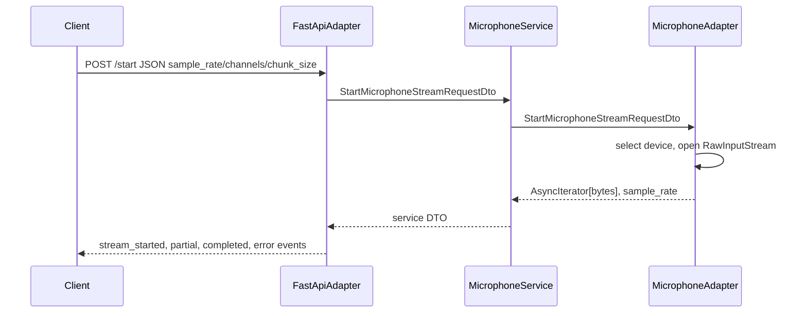
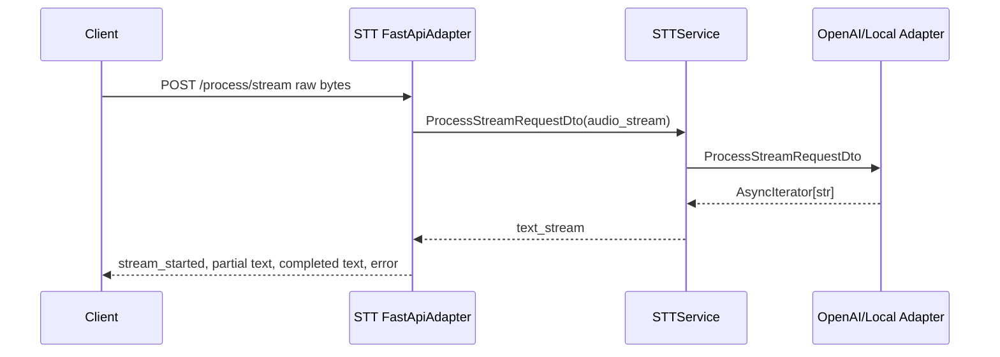
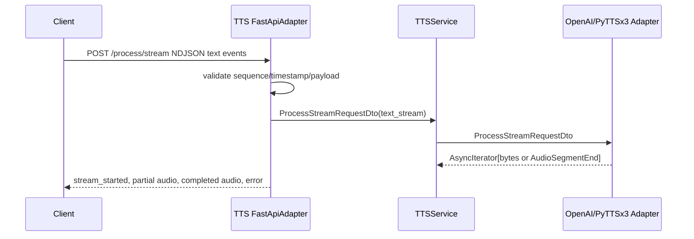
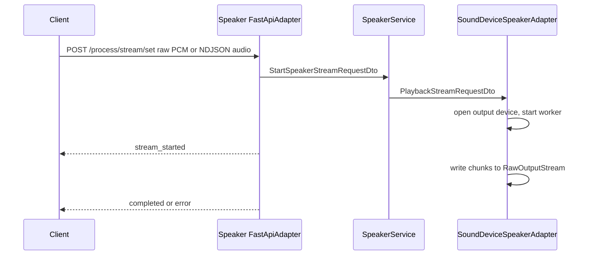

# FULL_OBLIVION Microservices Architecture and Layer Audit

Date: 2026-06-25

Scope: this audit analyzes the implemented non-`brain` microservices in `D:\Hobbys\IA\FULL_OBLIVION`: `microphone_microservice`, `stt_microservice`, `tts_microservice`, and `speaker_microservice`. The `brain_microservice` source, tests, docs, and deployment role are intentionally excluded except where root deployment files mention downstream URLs or compose wiring for the analyzed services.

## Executive Summary

The repository contains four peripheral Python/FastAPI microservices that form an audio pipeline around an excluded `brain` orchestrator:


Verified implementation style: all four services use a ports-and-adapters pattern with `main.py`, `composition_root`, `application` DTOs/ports/services, and `infrastructure` adapters. Runtime state is ephemeral and streaming-centric. There are no database schemas, migrations, repositories, durable queues, caches, or object stores in the analyzed services.

Primary strengths:

- Clear service directories under `D:\Hobbys\IA\FULL_OBLIVION\repos`.
- Repeated layer organization: FastAPI inbound adapter, application service, abstract ports, DTO mappers, outbound adapter.
- Stream-contract tests exist for all four services.
- Root Docker Compose, generated Dockerfiles, health checks, and root env template exist for deployment.

Primary risks:

- No authentication or authorization is implemented on any analyzed service.
- The services expose powerful local capabilities: microphone capture, speaker playback, and OpenAI API spend.
- Stream state is single-instance and in-memory. There is no durable replay, idempotency key, distributed lock, queue, or horizontal scaling model.
- Contract validation is uneven: STT/TTS/speaker validate NDJSON streams deeply, while JSON response envelopes and numeric query parameters mostly rely on FastAPI defaults or manual checks.
- Configuration is spread across root `.env.example`, service `.env.example`, runtime environment loaders, compose mappings, and docs.
- Readiness is shallow for microphone and speaker. Docker health checks use `/health`, which can pass even when audio hardware cannot open.

I attempted to run `windows\Scripts\python.exe -m pytest --collect-only -q`, but no such local runtime path exists in this checkout, so no tests were executed as part of this audit.

## Service Inventory

| Service | Determination | Runtime/framework | Path | Entry points | Main responsibility |
|---|---|---|---|---|---|
| Microphone | Root `services.yml` registers `microphone`; root compose builds `repos/microphone_microservice`; code exposes FastAPI routes. | Python 3.12, FastAPI, Uvicorn, sounddevice/PortAudio, NumPy. | `D:\Hobbys\IA\FULL_OBLIVION\repos\microphone_microservice` | `main.py`; `composition_root\setup\setup.py`; Docker `CMD ["python", "main.py"]`. | Open one local input device and stream PCM16 microphone events over HTTP. |
| STT | Root `services.yml` registers `stt`; root compose builds `repos/stt_microservice`; code exposes STT routes. | Python 3.12, FastAPI, Uvicorn, OpenAI SDK or faster-whisper, httpx. | `D:\Hobbys\IA\FULL_OBLIVION\repos\stt_microservice` | `main.py`; `composition_root\setup\setup.py`; Docker `CMD ["python", "main.py"]`. | Convert streamed or batch audio to text. |
| TTS | Root `services.yml` registers `tts`; root compose builds `repos/tts_microservice`; code exposes TTS routes. | Python 3.12, FastAPI, Uvicorn, OpenAI SDK or pyttsx3, wave/tempfile. | `D:\Hobbys\IA\FULL_OBLIVION\repos\tts_microservice` | `main.py`; `composition_root\setup\setup.py`; Docker `CMD ["python", "main.py"]`. | Convert streamed or batch text to audio. |
| Speaker | Root `services.yml` registers `speaker`; root compose builds `repos/speaker_microservice`; code exposes playback route. | Python 3.12, FastAPI, Uvicorn, sounddevice/PortAudio, httpx. | `D:\Hobbys\IA\FULL_OBLIVION\repos\speaker_microservice` | `main.py`; `composition_root\setup\setup.py`; Docker `CMD ["python", "main.py"]`. | Consume audio stream bytes/events and play them on local output hardware. |

Supporting runtime components:

- Root Docker Compose: `D:\Hobbys\IA\FULL_OBLIVION\docker-compose.yml`.
- Service catalog: `D:\Hobbys\IA\FULL_OBLIVION\services.yml`.
- Generated Dockerfiles: `D:\Hobbys\IA\FULL_OBLIVION\dockerfiles\microphone.Dockerfile`, `stt.Dockerfile`, `tts.Dockerfile`, `speaker.Dockerfile`.
- Root run/simulation scripts under `D:\Hobbys\IA\FULL_OBLIVION\scripts`.
- Systemd wrappers under `D:\Hobbys\IA\FULL_OBLIVION\systemd`.

## Repository Structure Overview

Recurring service structure:

```text
repos/<service>_microservice/
  main.py
  requirements.windows.txt
  requirements.linux.txt
  Dockerfile
  README.md
  application/
    dtos/
    ports/
    services/service.py
  composition_root/
    containers/container.py
    dependencies/<service>_dependency.py
    setup/setup.py
  infrastructure/
    inbound/http/fastapi_adapter.py
    outbound/...
  runtime/ or infrastructure logger/config modules
  tests/
```

Verified recurring patterns:

- `composition_root` constructs dependencies and FastAPI apps.
- `application/ports` defines abstract base classes.
- `application/dtos` uses frozen dataclasses for boundary DTOs.
- `application/dtos/mapper` maps layer DTOs, often isomorphic.
- `infrastructure/inbound/http/fastapi_adapter.py` registers routes inside a `FastApiAdapter`.
- `application/services/service.py` is framework-neutral orchestration.
- `infrastructure/outbound` owns hardware or provider SDK access.

Important inconsistencies:

- Microphone uses `composition_root\runtime\logger.py`; STT and speaker use `runtime\logger.py`; TTS uses `infrastructure\logger.py`.
- TTS has the most extensive docs (`README.md`, `README_STREAMING.md`, `PROJECT_STRUCTURE.md`); STT has less service-local documentation.
- Speaker defines `InitInboundAdapterDto.allow_origins` but the inspected dependency code does not register CORS middleware.
- Microphone has no FastAPI lifespan hook; cleanup is after `server.serve()`.
- STT and TTS support both coupled and decoupled `set`/`get` stream flows; microphone emits directly; speaker only consumes.

## Cross-Service Architecture Map


## Service Interaction Matrix

| Source | Target | Protocol | Contract | Config discovery | Failure behavior |
|---|---|---|---|---|---|
| External client or excluded brain | Microphone | HTTP `POST /start`, `POST /stop`, `GET /available`, `GET /health` | NDJSON/SSE events with `bytes_base64` and `output_bytes_base64`; JSON envelopes for status endpoints. | Root `.env.example` maps `MICROPHONE_*`; service setup reads `SERVICE_HOST`/`SERVICE_PORT` or microphone aliases. | HTTP 500 JSON for start/stop/available exceptions; stream emits error event if generator fails. |
| External client or excluded brain | STT | HTTP `POST /process/stream`, `POST /process/stream/set`, `GET /process/stream/get`, `POST /process/batch`, `GET /available`, `POST /stop`, `GET /health` | Raw audio or NDJSON audio events in; SSE/NDJSON text events out; batch JSON/base64 body. | `STT_ENGINE`, `STT_LANGUAGE`, `OPENAI_API_KEY`, `AUTOLOAD_VOICE_STREAM_URL`. | Route-level HTTP 500 JSON; streaming error events; OpenAI engine startup fails if key missing. |
| External client or excluded brain | TTS | HTTP `POST /process/stream`, `POST /process/stream/set`, `GET /process/stream/get`, `POST /process/batch`, `GET /available`, `GET /health` | NDJSON text events in; NDJSON/SSE audio events out; batch JSON/base64 audio. | `TTS_ADAPTER`, `TTS_SPEECH_RATE`, `OPENAI_*`. | Route-level HTTP 400 for invalid stream input in some paths, HTTP 500 for exceptions, stream error events. |
| External client or excluded brain | Speaker | HTTP `POST /process/stream/set`, `GET /health` | Raw PCM body or NDJSON audio events in; NDJSON status events out. | `SPEAKER_DEVICE_INDEX`, `SPEAKER_DEVICE_KEYWORDS`, `AUTOLOAD_STREAM_URL`, `ALLOWED_ORIGINS`. | Setup failure returns HTTP 500 JSON; playback/read failures emit NDJSON error events. |
| STT autoloader | Microphone or configured URL | HTTP stream client via httpx | Pulls bytes from `AUTOLOAD_VOICE_STREAM_URL`, then calls inbound adapter `process_stream`. | `AUTOLOAD_VOICE_STREAM_URL`. | Catches `httpx.RequestError` and reconnects after 5 seconds. |
| Speaker autoloader | TTS or configured URL | HTTP stream client via httpx | Pulls bytes from `AUTOLOAD_STREAM_URL`, then calls inbound adapter `play`. | `AUTOLOAD_STREAM_URL`. | Retries after request or generic errors; switches POST to GET after 405. |

No analyzed service imports another analyzed service directly. Inter-service coupling is via HTTP contracts, root env URLs, and repeated stream event shape.

## Dependency Map

| Service | Internal dependencies | External runtime dependencies | State dependencies |
|---|---|---|---|
| Microphone | FastAPI adapter -> service -> outbound sounddevice adapter. DTO mappers between each boundary. | `fastapi`, `uvicorn`, `sounddevice`, `numpy`, local audio input device, PortAudio. | In-memory `started`, sample rate, chunk size, stream handles. No database/cache/queue. |
| STT | FastAPI adapter -> service -> OpenAI or local outbound adapter; optional autoloader. | `openai`, `faster-whisper`, `numpy`, `httpx`, Hugging Face model cache volume in compose. | In-memory shared stream queue/task. `stt-model-cache` volume for local model cache only. |
| TTS | FastAPI adapter -> service -> OpenAI or pyttsx3 outbound adapter. | `openai`, `pyttsx3`, `espeak` libs in Dockerfile, temp WAV files for local synthesis. | In-memory shared stream queue/task. Temporary files in OS temp directory. |
| Speaker | FastAPI adapter -> service -> sounddevice outbound adapter; optional autoloader. | `sounddevice`, `httpx`, local audio output device, PortAudio/ALSA. | In-memory playback task, queue, stream handle. No durable state. |

Dependency direction is mostly clean: inbound infrastructure depends on application ports/DTOs; application depends on ports/DTOs; outbound infrastructure implements ports. A notable leaky boundary is that FastAPI types appear in inbound port definitions through `get_app`, and runtime logger modules are imported throughout all layers.

## Per-Service Layer Analysis

### Microphone

#### Summary

- Path: `D:\Hobbys\IA\FULL_OBLIVION\repos\microphone_microservice`.
- Responsibility: expose local microphone capture as NDJSON/SSE stream events.
- Framework: FastAPI/Uvicorn.
- Entry point: `main.py` imports `setup()` and runs `asyncio.run(setup())`.
- Routes verified in `infrastructure\inbound\http\fastapi_adapter.py`: `POST /start` at line 189, `POST /stop` at line 230, `GET /available` at line 262, `GET /health` at line 294.

Layer map:

| Layer | Files | Purpose | Missing or weak areas |
|---|---|---|---|
| Bootstrap | `main.py`; `composition_root\setup\setup.py` | Starts logging, builds container, resolves bind host/port, runs Uvicorn. | No lifespan hook; cleanup happens after Uvicorn serve exits. |
| Composition | `composition_root\containers\container.py`; `composition_root\dependencies\microphone_dependency.py` | Creates `MicrophoneAdapter`, `MicrophoneService`, FastAPI app, `FastApiAdapter`. | Hardcoded fallback rate and empty target keywords in `BuildContainer`. |
| API/inbound | `infrastructure\inbound\http\fastapi_adapter.py` | HTTP route handlers, stream event encoding, silence segmentation, error envelopes. | No auth; silence threshold hardcoded constants; error responses expose exception text. |
| Application | `application\services\service.py` | Maps DTOs and delegates to outbound port. | Business logic is thin; silence/event logic lives in HTTP adapter rather than service layer. |
| Ports | `application\ports\*.py` | ABC contracts for inbound, service, outbound. | `get_app` leaks framework object through port. |
| DTO/schema | `application\dtos\*.py`; mapper files | Frozen dataclasses and explicit mappers. | Same DTO shapes duplicated across boundaries. No Pydantic schemas beyond FastAPI dataclass parsing. |
| Outbound/hardware | `infrastructure\outbound\windows_sounddevice.py` | Device selection, RawInputStream lifecycle, async byte iterator, stereo downmix. | Single global-ish adapter state; no lock around concurrent `/start`. |
| Observability | `composition_root\runtime\logger.py` and logger calls | Structured startup/stream logs. | Telemetry writes directly to stdout in `_log_telemetry`. |
| Persistence | None verified | N/A. | No durable state or replay. |
| Tests | `tests\test_start_endpoint.py`, `tests\test_runtime_environment.py`, `tests\simple.py` | Stream event contract and runtime env behavior. | No hardware adapter unit tests; no disconnect cleanup test. |

Main flow:



Data contracts:

- Start request dataclasses define `sample_rate: int = 16000`, `channels: int = 1`, `chunk_size: int = 1024`.
- Stream event shape: `{type, sequence, timestamp, payload}`.
- `partial` payload: `{"bytes_base64": "..."}`.
- `completed` payload: `{"reason": "completed", "output_bytes_base64": "..."}`.
- `error` payload: `{"code": "audio_stream_failed", "message": "...", "recoverable": true}`.

File-level pattern analysis:

- `main.py`: process entrypoint. Imports composition root and logger only.
- `composition_root\setup\setup.py`: runtime bootstrap and cleanup. Reads `SERVICE_HOST` or `MICROPHONE_SERVICE_HOST`, `SERVICE_PORT` or `MICROPHONE_SERVICE_PORT` at lines 31-32 and creates `uvicorn.Config` at line 38.
- `composition_root\dependencies\microphone_dependency.py`: dependency graph builder. Creates FastAPI app at line 54 and registers adapter.
- `application\services\service.py`: application orchestration. All methods map service DTOs to outbound DTOs and back.
- `infrastructure\inbound\http\fastapi_adapter.py`: largest behavioral file. Owns event serialization, silence detection, endpoint envelopes, and media type negotiation.
- `infrastructure\outbound\windows_sounddevice.py`: hardware adapter. Owns `SoundDeviceAsyncStream` and `MicrophoneAdapter`; validates positive stream parameters and prevents second active stream.

Security notes:

- No authentication or authorization.
- `/start` exposes live microphone capture to any reachable caller.
- Error JSON includes raw exception text in `message` and `data`.
- Service can bind `0.0.0.0` through env/compose.

Reliability notes:

- Single active stream only.
- `/stop` is idempotent when inactive.
- No retry for hardware opening except sample-rate/default/stereo fallback.
- No durable queue. In-flight audio is lost on crash.

Strengths: simple route surface, explicit event contract, contract tests, cleanup path.

Weaknesses: HTTP adapter owns audio segmentation logic, no auth, hardware readiness not covered by `/health`, no lock for concurrent start race.

Architecture maturity score: 6/10.

### STT

#### Summary

- Path: `D:\Hobbys\IA\FULL_OBLIVION\repos\stt_microservice`.
- Responsibility: transcribe audio streams or batches to text.
- Framework: FastAPI/Uvicorn; OpenAI or local faster-whisper backend.
- Routes verified in `infrastructure\inbound\http\fastapi_adapter.py`: `GET /health` line 283, `GET /available` line 298, `POST /stop` line 331, `POST /process/stream` line 361, `POST /process/stream/set` line 421, `GET /process/stream/get` line 492, `POST /process/batch` line 548.

Layer map:

| Layer | Files | Purpose | Missing or weak areas |
|---|---|---|---|
| Bootstrap | `main.py`; `composition_root\setup\setup.py`; `runtime\environment.py` | Loads `.env`, applies launch environment, starts Uvicorn. | `apply_launch_environment()` is called in both setup and dependency generation. |
| Composition | `composition_root\dependencies\stt_dependency.py` | Selects `OpenAISTTAdapter` or `LocalSTTAdapter` from env, creates FastAPI app and lifespan. | Startup fails hard when `STT_ENGINE=openai` and no key. |
| API/inbound | `infrastructure\inbound\http\fastapi_adapter.py`; `stream_events.py` | Validates/decodes NDJSON audio input, returns text events, handles set/get shared stream. | Some stream input validation does not enforce timestamp/sequence as deeply as TTS/speaker. |
| Application | `application\services\service.py` | Delegates process/batch/availability to outbound adapter; manages shared decoupled stream. | Shared queue/task semantics are in memory only. |
| Outbound/provider | `infrastructure\outbound\openai_stt_adapter.py`; `local_stt_adapter.py` | OpenAI Whisper or faster-whisper local transcription. | External call retries/timeouts are not clearly centralized in inspected code. |
| Background job | `infrastructure\inbound\http\voice_stream_autoloader.py` | Optional reconnecting pull client for an upstream voice stream. | Infinite retry loop with fixed 5-second sleep; no max retries/circuit breaker. |
| Persistence | none; model cache volume in compose | Local model cache uses `stt-model-cache:/root/.cache/huggingface`. | No transactional state. |
| Tests | `test_stream_contract.py`, `test_environment.py`, `test_adapter_final_flush.py`, `simple.py` | Stream contracts, env loading, final buffer flushing. | No live OpenAI tests in normal suite; no container health tests. |

Main flow:



Decoupled flow:

- `POST /process/stream/set` accepts raw or NDJSON audio and starts/feeds shared processing.
- `GET /process/stream/get` streams text events from the current shared stream.
- `POST /stop` stops the active shared stream.

Data contracts:

- Audio input DTO: `audio_stream`, `sample_rate=16000`, `chunk_size=1024`, `silence_threshold=150`, `silence_limit_seconds=2.0`.
- Batch input: bytes plus sample rate.
- Text output events use `partial: {"text": "..."}` and `completed: {"reason":"completed","output":"..."}`.
- NDJSON audio input accepts `partial.bytes_base64` and `completed.output_bytes_base64`; completed may inject silence boundaries.

File-level pattern analysis:

- `main.py`: explicitly loads local `.env` before project imports that read env.
- `runtime\environment.py`: resolves VS Code launch/env files and process env precedence.
- `composition_root\dependencies\stt_dependency.py`: env-driven backend selection. Reads `STT_ENGINE`, `STT_LANGUAGE`, `OPENAI_API_KEY`, `AUTOLOAD_VOICE_STREAM_URL`.
- `infrastructure\inbound\http\fastapi_adapter.py`: owns HTTP contracts, NDJSON decoding, `InputStreamResponse`, and route handlers.
- `infrastructure\inbound\http\stream_events.py`: reusable event formatter and text stream generator.
- `infrastructure\outbound\local_stt_adapter.py`: local VAD/transcription using faster-whisper, NumPy resampling, final flush.
- `infrastructure\outbound\openai_stt_adapter.py`: OpenAI-backed transcription adapter.

Security notes:

- No auth.
- If exposed, `/process/batch` and stream endpoints can trigger OpenAI spend or local CPU load.
- `OPENAI_API_KEY` is injected as environment variable; root docs recommend secrets, but compose uses env mapping.
- Logs include transcribed text in local/autoload paths, which may be sensitive.

Reliability notes:

- OpenAI engine requires key at dependency construction, so missing key blocks startup.
- Shared decoupled stream has single active state and no durable handoff.
- Autoloader reconnects on network failure but has no backoff jitter.

Strengths: best test coverage among services; supports local and OpenAI adapters; explicit stream event helpers.

Weaknesses: no auth, ephemeral queue, no durable retry/timeout policy, sensitive text logging risk.

Architecture maturity score: 7/10.

### TTS

#### Summary

- Path: `D:\Hobbys\IA\FULL_OBLIVION\repos\tts_microservice`.
- Responsibility: synthesize text streams or batches into audio.
- Framework: FastAPI/Uvicorn; OpenAI or pyttsx3 backend.
- Routes verified in `infrastructure\inbound\http\fastapi_adapter.py`: `GET /health` line 559, `GET /available` line 574, `POST /process/stream` line 606, `POST /process/stream/set` line 694, `GET /process/stream/get` line 726, `POST /process/batch` line 776.

Layer map:

| Layer | Files | Purpose | Missing or weak areas |
|---|---|---|---|
| Bootstrap | `main.py`; `composition_root\setup\setup.py`; `infrastructure\config.py` | Resolve environment, load env file, bind Uvicorn. | Config parsing can fail on invalid integer/float values without structured config errors. |
| Composition | `composition_root\dependencies\tts_dependency.py` | Select backend from `TTS_ADAPTER`, build service, FastAPI app, lifespan init. | Unknown adapter raises startup `ValueError`; no feature flag validation layer. |
| API/inbound | `infrastructure\inbound\http\fastapi_adapter.py` | Validates NDJSON text input, streams audio events, supports set/get and batch. | Large file combines validation, protocol encoding, and route handling. |
| Application | `application\services\service.py` | Initializes outbound adapter, delegates stream/batch/availability. | Thin orchestration only. |
| Outbound/provider | `openai_tts_adapter.py`; `pyttsx3_adapter.py` | Calls OpenAI `/audio/speech` or local pyttsx3 subprocess/temp WAV. | Local adapter writes temp files; no quota/rate limiting for OpenAI. |
| DTO/schema | `application\dtos\*.py`; mapper files | Frozen dataclass DTOs and explicit mappers. | Boundary DTOs are mostly identical and duplicated. |
| Tests | `test_stream_contract.py`, `test_decoupled_stream.py`, `simple.py` | Detailed HTTP stream contracts and manual live decoupled test. | `test_decoupled_stream.py` depends on running service via `TTS_TEST_BASE_URL`. |

Main flow:



Data contracts:

- Text input stream events require `stream_started`, `partial.text`, and final `completed.reason/output`.
- Audio output events use `partial.bytes_base64`, `byte_count`, `chunk_index`; completed includes `output_bytes_base64`, `total_bytes`, `chunk_count`.
- Batch endpoint accepts text and returns audio bytes encoded through JSON response logic in the inbound adapter.
- `AudioSegmentEnd` and `AudioStreamError` marker dataclasses let outbound adapters signal logical completion/errors.

File-level pattern analysis:

- `infrastructure\config.py`: environment resolution from process env and VS Code launch profile.
- `composition_root\dependencies\tts_dependency.py`: reads `TTS_ADAPTER`, `TTS_SPEECH_RATE`, `TTS_VOICE_NAME`, `OPENAI_API_KEY`, `OPENAI_TTS_MODEL`, `OPENAI_TTS_VOICE`, `OPENAI_TTS_RESPONSE_FORMAT`, `OPENAI_TTS_INSTRUCTIONS`, `OPENAI_TTS_SPEED`, `OPENAI_BASE_URL`.
- `infrastructure\inbound\http\fastapi_adapter.py`: validates standard stream event shape and controls response format negotiation.
- `infrastructure\outbound\tts\openai_tts_adapter.py`: validates required OpenAI key and response format; streams from speech API.
- `infrastructure\outbound\tts\pyttsx3_adapter.py`: uses subprocess/temp WAV and a decoupled audio queue.
- `README.md`, `README_STREAMING.md`, and `PROJECT_STRUCTURE.md`: extensive service-local docs and architecture template.

Security notes:

- No auth.
- OpenAI API key is an env var; no secret backend.
- Endpoint can consume paid API calls.
- Text inputs may be logged by adapter/service paths.

Reliability notes:

- Stream events convert backend exceptions into error events in many paths.
- No global rate limits, concurrency limits, or circuit breakers.
- Decoupled stream is a single shared flow; concurrent callers can interfere.

Strengths: strongest documentation; robust stream contract validation; dual backend abstraction.

Weaknesses: large inbound adapter, no auth/rate limiting, duplicated DTOs, in-memory single-flow stream.

Architecture maturity score: 7/10.

### Speaker

#### Summary

- Path: `D:\Hobbys\IA\FULL_OBLIVION\repos\speaker_microservice`.
- Responsibility: consume audio bytes/events and play to local output hardware.
- Framework: FastAPI/Uvicorn; sounddevice output.
- Routes verified in `infrastructure\inbound\http\fastapi_adapter.py`: `GET /health` line 116, `POST /process/stream/set` line 131.

Layer map:

| Layer | Files | Purpose | Missing or weak areas |
|---|---|---|---|
| Bootstrap | `main.py`; `composition_root\setup\setup.py`; `runtime\environment.py` | Configures logging, loads env, starts Uvicorn. | `_cleanup` currently placeholder; actual cleanup is lifespan. |
| Composition | `composition_root\dependencies\speaker_dependency.py` | Reads device/env config, creates app with lifespan cleanup and autoload hook. | `ALLOWED_ORIGINS` is parsed but CORS middleware not verified in inspected code. |
| API/inbound | `infrastructure\inbound\http\fastapi_adapter.py` | Accepts raw or NDJSON audio stream and responds NDJSON status events. | Route surface intentionally minimal; no `/available`. |
| Application | `application\services\service.py` | Maps inbound to outbound playback request and cleanup. | Thin; hardware concurrency policy lives mainly in outbound adapter. |
| Outbound/hardware | `infrastructure\outbound\speaker\sounddevice_adapter.py` | Selects output device, opens RawOutputStream, writes bytes via worker queue. | Single output stream; playback replacement policy can truncate prior audio. |
| Background job | `infrastructure\inbound\http\audio_stream_autoloader.py` | Optional pull client from `AUTOLOAD_STREAM_URL`. | Fixed retry sleep; trusts remote bytes. |
| Tests | `test_stream_contract.py`, `conftest.py`, `simple.py` | Rich input validation and route surface tests. | No hardware adapter tests with sounddevice mocked deeply. |

Main flow:



Data contracts:

- Raw request body: bytes interpreted as PCM for configured `sample_rate=24000`, `channels=1` defaults.
- NDJSON input: must begin with monotonic `stream_started`, `partial.bytes_base64` contains audio; `completed` is accepted as logical boundary and does not end request by itself.
- Response NDJSON: `stream_started`, `completed` with `reason=end_of_input`, optional `heartbeat`, `error`.

File-level pattern analysis:

- `composition_root\dependencies\speaker_dependency.py`: reads `SPEAKER_DEVICE_INDEX`, `SPEAKER_DEVICE_KEYWORDS`, `ALLOWED_ORIGINS`, `AUTOLOAD_STREAM_URL`; creates app lifespan.
- `infrastructure\inbound\http\fastapi_adapter.py`: validates NDJSON, defines `RequestBodySafeStreamingResponse` to avoid competing ASGI receive consumers, and coordinates setup acknowledgement.
- `infrastructure\outbound\speaker\sounddevice_adapter.py`: owns device selection, `RawOutputStream`, playback queue, worker task, cleanup.
- `infrastructure\inbound\http\audio_stream_autoloader.py`: reconnecting pull worker; falls back from POST to GET on 405.

Security notes:

- No auth.
- Any reachable caller can play arbitrary audio on the host speaker.
- `AUTOLOAD_STREAM_URL` is trusted; if configured to an untrusted URL, arbitrary bytes are played.

Reliability notes:

- Hardware failures surface as HTTP 500 on setup.
- New playback cleans up active playback before opening a new stream.
- `/health` does not validate speaker device availability.

Strengths: narrow route surface; careful ASGI streaming response; strong input validation tests.

Weaknesses: no auth, no `/available`, no rate/concurrency controls beyond replacement, parsed CORS config not applied.

Architecture maturity score: 6/10.

## Data and Contract Analysis

Shared event shape:

```json
{"type":"stream_started|partial|completed|heartbeat|error","sequence":1,"timestamp":"2026-05-24T12:00:00Z","payload":{}}
```

Contract duplication:

- Microphone, STT, TTS, and speaker each define event encoders or validators independently.
- DTO classes are duplicated per layer (`adapter_inbound_dtos.py`, `services_dtos.py`, `adapter_outbound_dtos.py`) even when fields are identical.
- Tests assert similar event shape in multiple services, but there is no shared package for canonical event schema.

Validation maturity:

- TTS validates event type, sequence, timestamp, and payload shape for text streams.
- Speaker validates NDJSON playback input deeply, including sequence, timestamp, base64, and start-before-audio.
- STT validates and decodes NDJSON audio input, but event validation is less uniform across all routes.
- Microphone relies on FastAPI dataclass parsing for request fields plus outbound adapter checks for positive numeric parameters.

Database and storage contracts:

- No database schemas, migrations, ORM models, repositories, tables, collections, caches, durable queues, or object storage contracts were verified.
- STT has a compose model-cache volume only.

## Configuration Analysis

Root configuration:

- Root `.env.example` contains host ports and service-scoped variables for all services.
- `docker-compose.yml` maps service-scoped root variables into each container's expected env names.
- `services.yml` documents repo names, ports, profiles, health endpoints, devices, volumes, and build patches.

Per-service configuration:

- Microphone: `SERVICE_HOST`, `SERVICE_PORT`, `MICROPHONE_SERVICE_HOST`, `MICROPHONE_SERVICE_PORT`, runtime env/logging variables.
- STT: `SERVICE_HOST`, `SERVICE_PORT`, `STT_ENGINE`, `STT_LANGUAGE`, `OPENAI_API_KEY`, `AUTOLOAD_VOICE_STREAM_URL`.
- TTS: `SERVICE_HOST`, `SERVICE_PORT`, `TTS_ADAPTER`, `TTS_SPEECH_RATE`, `TTS_VOICE_NAME`, `OPENAI_API_KEY`, `OPENAI_TTS_MODEL`, `OPENAI_TTS_VOICE`, `OPENAI_TTS_RESPONSE_FORMAT`, `OPENAI_TTS_INSTRUCTIONS`, `OPENAI_TTS_SPEED`, `OPENAI_BASE_URL`.
- Speaker: `SERVICE_HOST`, `SERVICE_PORT`, `SPEAKER_DEVICE_INDEX`, `SPEAKER_DEVICE_KEYWORDS`, `ALLOWED_ORIGINS`, `AUTOLOAD_STREAM_URL`.

Risks:

- Secrets are environment variables, not Docker secrets or a secret manager.
- Invalid integer/float env values can crash startup.
- Compose health checks use fixed localhost/internal ports; if service port env changes in some services, the health check can drift.
- Documentation and code disagree in places historically; root docs note microphone hardcoding, while current source and generated Dockerfile show env-aware binding.

## Persistence and State Analysis

| Service | Owns data? | State | Migration strategy | Consistency risks |
|---|---|---|---|---|
| Microphone | No durable data. | Active sounddevice stream and buffered event output per HTTP stream. | None. | Concurrent `/start` race; crash loses audio; `/available` means active stream, not hardware readiness. |
| STT | No durable data. | Active decoupled stream, queues/tasks; optional model cache volume. | None. | Single shared stream can be replaced/stopped; no replay if consumer disconnects. |
| TTS | No durable data. | Active decoupled audio queue/task; temp WAV files in local adapter. | None. | Concurrent set/get ambiguity; temp file cleanup depends on finally paths. |
| Speaker | No durable data. | Active playback task/queue/RawOutputStream. | None. | New playback cancels/replaces existing playback; crash may leave audio truncated. |

## Error Handling and Reliability Review

Verified patterns:

- Route handlers commonly catch `Exception` and return HTTP 500 JSON envelopes.
- Stream producers emit `error` events when failures happen after response streaming begins.
- STT and speaker autoloaders retry network failures after 5 seconds.
- Speaker and TTS define custom streaming response classes to avoid ASGI receive-channel conflicts.

Gaps:

- No central error taxonomy shared across services.
- No timeout policy for most provider/hardware operations beyond Uvicorn keep-alive or httpx autoloader `timeout=None`.
- No dead-letter queue, retry queue, idempotency key, or replay.
- No circuit breakers for OpenAI or hardware failures.
- `/health` is mostly liveness, not readiness.

## Security Review

Cross-service findings:

- Authentication: missing in all analyzed services.
- Authorization: missing in all analyzed services.
- Input validation: strongest for stream NDJSON; weaker for JSON envelopes, query bounds, payload size, and request body size.
- Secret handling: OpenAI keys are env vars and root `.env` values.
- Sensitive logging: STT logs transcription text in some paths; TTS may log text length and provider config; error responses expose exception messages.
- Transport security: HTTP only in local compose; no TLS/mTLS configuration.
- Injection risks: no SQL or shell command injection into a database was found; pyttsx3 uses subprocess with controlled Python invocation and text written through script logic, but text-to-provider/content abuse remains possible.
- File/path handling: TTS local adapter uses temporary WAV files and removes them in finally blocks.

Highest-impact security concerns:

1. Network-reachable microphone and speaker control without auth.
2. OpenAI spend endpoints without auth/rate limits.
3. Sensitive audio/transcription/text data in logs or wire payloads.

## Testing Review

Verified test files:

- Microphone: `tests\test_start_endpoint.py`, `tests\test_runtime_environment.py`, `tests\simple.py`.
- STT: `tests\test_stream_contract.py`, `tests\test_environment.py`, `tests\test_adapter_final_flush.py`, `tests\simple.py`.
- TTS: `tests\test_stream_contract.py`, `tests\test_decoupled_stream.py`, `tests\simple.py`.
- Speaker: `tests\test_stream_contract.py`, `tests\conftest.py`, `tests\simple.py`.

Strengths:

- Strong contract tests for NDJSON/SSE stream shape.
- Tests use fake services/adapters to isolate HTTP adapter behavior.
- STT tests include final flush logic for local and OpenAI adapter stream classes.
- Microphone tests cover silence segmentation and error event shape.

Gaps:

- No repository-level CI config was verified.
- No coverage reports.
- No contract tests shared across services from one canonical schema package.
- Hardware paths are mostly manual or shallowly tested.
- Docker Compose health/readiness is not automatically tested.

## Cross-Service Pattern Comparison

| Pattern | Microphone | STT | TTS | Speaker |
|---|---|---|---|---|
| FastAPI inbound adapter | Yes | Yes | Yes | Yes |
| Application service over ports | Yes | Yes | Yes | Yes |
| DTO mappers | Yes | Yes | Yes | Partial/simple |
| Decoupled set/get stream | No | Yes | Yes | No, set only |
| Batch endpoint | No | Yes | Yes | No |
| Availability endpoint | Yes, active stream only | Yes, engine | Yes, engine | No |
| Optional autoloader | No | Yes | No verified autoload config in DTO, but port includes hooks | Yes |
| Hardware dependency | Input device | Optional local model CPU | Optional local TTS libs | Output device |
| External paid API | No | OpenAI optional/default | OpenAI optional/default in root env | No |
| Durable persistence | No | No | No | No |
| Auth | No | No | No | No |
| Contract tests | Yes | Yes | Yes | Yes |
| Docs maturity | Medium | Medium-low | High | High |

Best patterns to reuse:

- TTS stream validation and documentation.
- Speaker ASGI-safe response for simultaneous request-body consumption and response streaming.
- STT final-flush testing.
- Microphone silence segmentation tests.

## Prioritized Findings

### Critical

None verified that necessarily causes production outage or data corruption in the current local/hobby deployment model. If any service is exposed beyond a trusted LAN, the missing authentication becomes critical.

### High

1. No authentication or authorization on microphone, speaker, STT, or TTS.
   - Evidence: no route dependencies, auth middleware, token checks, or authorization layer found in the FastAPI adapters.
   - Impact: remote microphone capture, remote speaker playback, OpenAI spend abuse, data exposure.

2. Single shared in-memory stream state prevents safe horizontal scaling or concurrent pipelines.
   - Evidence: service docs and implementations use one active stream/queue/task per adapter.
   - Impact: concurrent callers can replace or interfere with each other; no recovery after crash.

3. Health checks are shallow.
   - Evidence: compose health checks call `/health`; microphone/speaker hardware opens happen on stream start/playback.
   - Impact: containers can be healthy while audio hardware is unavailable.

4. Secrets are plain environment variables.
   - Evidence: root `.env.example` and compose map `STT_OPENAI_API_KEY`/`TTS_OPENAI_API_KEY` to `OPENAI_API_KEY`.
   - Impact: accidental disclosure through env dumps/logs/process inspection.

### Medium

1. Stream event schema is duplicated across services.
2. DTO boundary duplication increases drift risk.
3. Config parsing is not centralized or strongly typed.
4. Error response envelopes expose raw exception text.
5. CORS configuration is parsed for speaker but middleware application was not verified.
6. Provider and autoloader retry/timeout policies are ad hoc.

### Low

1. Logger module placement differs across services.
2. Documentation depth varies substantially.
3. Some service docs contain historical notes that should be reconciled with current source.
4. Manual `simple.py` tests are useful but not CI-friendly.

## Improvement Roadmap

### Phase 1 - Critical Fixes

| Action | Affected services | Effort | Dependencies | Expected impact |
|---|---|---|---|---|
| Add service-to-service auth, such as shared bearer token or mTLS at proxy layer. | All four | Medium | Config and deployment update. | Prevents unauthorized capture/playback/API spend. |
| Add request size, stream duration, and concurrency limits. | All four | Medium | FastAPI middleware or per-route guards. | Reduces DoS and accidental runaway streams. |
| Replace raw env secrets with Docker secrets or host secret manager. | STT, TTS, root deployment | Medium | Deployment changes. | Safer API key handling. |
| Add readiness endpoints that verify backend/hardware availability. | Microphone, speaker, STT, TTS | Medium | Hardware-safe probing policy. | Better orchestration and startup diagnostics. |

### Phase 2 - Architecture and Consistency

| Action | Affected services | Effort | Dependencies | Expected impact |
|---|---|---|---|---|
| Extract shared stream-event schema/encoder/validator package. | All four | Medium | Agreement on canonical contract. | Reduces contract drift. |
| Standardize runtime config with Pydantic settings or equivalent. | All four | Medium | Env var inventory. | Clear required/optional config and errors. |
| Move protocol/silence business decisions out of large inbound adapters where appropriate. | Microphone, TTS, STT | Medium-large | Shared contract package. | Cleaner layer responsibilities. |
| Align logger/runtime package location. | All four | Low | Refactor imports. | Easier onboarding. |

### Phase 3 - Testing and Observability

| Action | Affected services | Effort | Dependencies | Expected impact |
|---|---|---|---|---|
| Add CI test matrix for stream contracts. | All four | Medium | Stable Python env. | Prevents contract regressions. |
| Add mocked hardware adapter unit tests. | Microphone, speaker | Medium | sounddevice fakes. | Better reliability without real devices. |
| Add OpenAI adapter tests with mocked HTTP/SDK responses and timeout cases. | STT, TTS | Medium | Mocking approach. | Safer provider failure handling. |
| Add metrics for stream starts, completions, errors, bytes, latency. | All four | Medium | Metrics backend decision. | Operational visibility. |

### Phase 4 - Documentation and Governance

| Action | Affected services | Effort | Dependencies | Expected impact |
|---|---|---|---|---|
| Publish one canonical contract document generated from shared schema/tests. | All four | Medium | Shared schema package. | Reduces ambiguity for clients. |
| Add service ownership and runbook pages. | All four | Low-medium | Operational decisions. | Faster incident response. |
| Add architecture decision records for single-stream design and deployment topology. | All four/root | Low | Maintainer review. | Clear scaling expectations. |
| Reconcile docs with current source after compose/Docker changes. | Root, microphone docs | Low | Doc pass. | Better onboarding. |

## Final Architecture Maturity Assessment

| Score | Value | Evidence |
|---|---:|---|
| Overall Microservice Architecture Maturity | 6.5/10 | Clear service boundaries and layer pattern, but no auth, no durable messaging, and single-stream state. |
| Layering Consistency | 7/10 | All services use composition/application/infrastructure; logger/config and some responsibilities differ. |
| Service Boundary Quality | 6/10 | HTTP boundaries are clear; shared stream contracts are duplicated and not centrally governed. |
| Contract Clarity | 7/10 | Tests and docs define event shape well, especially TTS/speaker; schemas are not shared. |
| Configuration Maturity | 5/10 | Root compose/env are present, but config parsing is spread out and weakly typed. |
| Reliability Maturity | 5/10 | Error events and cleanup exist, but no durable queues, no circuit breakers, shallow health checks. |
| Security Maturity | 3/10 | No auth/authorization/rate limits; secrets are env vars; sensitive capability exposure. |
| Testing Maturity | 6/10 | Good contract tests; limited hardware/provider/deployment coverage; no verified CI. |
| Operational Readiness | 5/10 | Dockerfiles/compose/health checks exist; readiness, metrics, tracing, secret handling are immature. |
| Developer Onboarding Readiness | 7/10 | Strong docs for TTS/speaker/root deployment; uneven docs elsewhere and duplicated patterns. |

Overall: the implementation is a coherent small-system microservice architecture optimized for local/hybrid audio experimentation. It is not yet production-grade for untrusted networks or multi-tenant/concurrent workloads. The fastest maturity gain is to secure the HTTP surfaces, centralize stream contracts/config, and add readiness plus operational tests.
